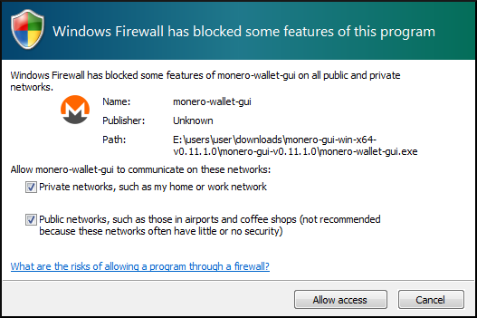
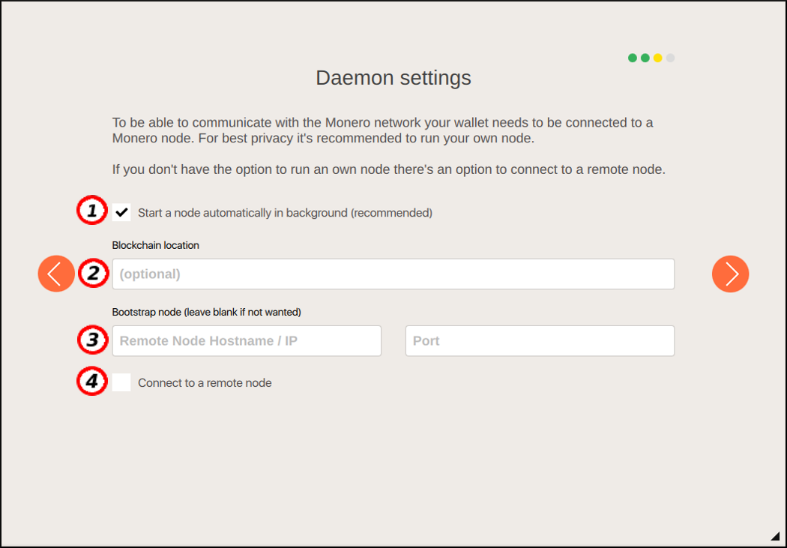
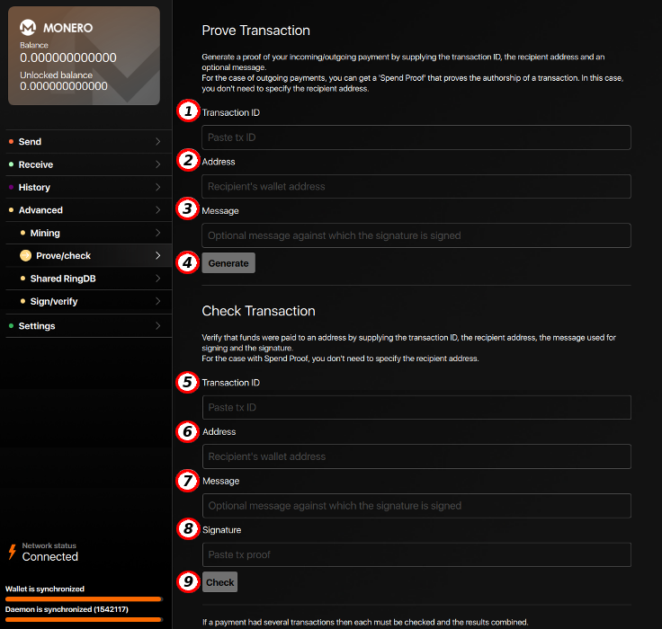
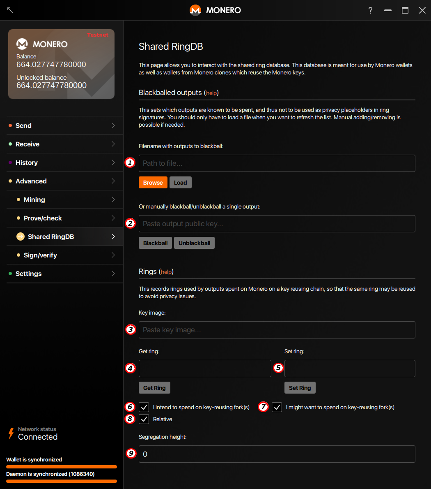

# Table of contents

0. **[Preface](#0-preface)**
   + 0.1. [Translations](#01-translations)
   + 0.2. [Windows Preparation](#02-windows-preparation)
   + 0.3. [Shortcuts](#03-shortcuts)
1. **[Choose a Language](#1-choose-a-language)**
2. **[Create a Wallet](#2-create-a-wallet)**   
   + 2.1. [Create new wallet](#21-create-new-wallet)
      + 2.1.1. [Add a password](#211-add-a-password)
      + 2.1.2. [Daemon settings](#212-daemon-settings)
      + 2.1.3. [Run a full node](#213-run-a-full-node)
   + 2.2. [Restore wallet from keys or mnemonic seed](#22-restore-wallet-from-keys-or-mnemonic-seed)    
      + 2.2.1. [Restoring from seed](#221-restoring-from-seed)
      + 2.2.2. [Restoring from keys](#222-restoring-from-keys)    
   + 2.3. [Open a wallet from file](#23-open-a-wallet-from-file)    
   + 2.4. [Create new wallet from hardware](#24-create-new-wallet-from-hardware)
      + 2.4.1. [Create the wallet](#241-create-the-wallet)
3. **[Send Monero](#3-send-monero)**    
   + 3.1. [Address Book](#31-address-book)
4. **[Receive Monero](#4-receive-monero)**    
5. **[Advanced Features](#5-advanced-features)**    
   + 5.1. [Solo mining](#51-solo-mining)    
   + 5.2. [Prove - check](#52-prove---check)    
      + 5.2.1. [Prove Transaction](#521-prove-transaction)
      + 5.2.2. [Check Transaction](#522-check-transaction)    
   + 5.3. [Shared RingDB](#53-shared-ringdb)
   + 5.4. [Sign - verify](#54-sign---verify)
      + 5.4.1. [Sign](#541-sign)
      + 5.4.2. [Verify](#542-verify)
6. **[Settings](#6-settings)**    
   + 6.1. [Seed - keys](#61-seed-and-keys)
7. **[Binaries Verification](#7-binaries-verification)**
8. **[About remote nodes](#8-about-remote-nodes)**
9. **[Common issues and solutions](#9-common-issues-and-solutions)**

# 0. Preface
This guide is open source and maintained by ErCiccione, of the Monero community. If you have suggestions or wish to contribute to the development of this guide, feel free to open Pull Requests or Issues on the
GitHub repository where this document is maintained: [github.com/monero-ecosystem/monero-GUI-guide](https://github.com/monero-ecosystem/monero-GUI-guide).
&nbsp;

For the online version of this guide, click [here](https://github.com/monero-ecosystem/monero-GUI-guide/blob/master/monero-GUI-guide.md)

## 0.1. Translations
This document will be localized into several languages. You can find all available translations in the [dedicated section on GitHub](https://github.com/monero-ecosystem/monero-GUI-guide/tree/master/translations).

## 0.2. Windows Preparation
If you are on Windows:

+ Make sure that your antivirus does not block the program.

+ The first time you start the wallet you must give permission to connect to the network via a pop-up. Check the appropriate boxes and click `Allow access`.

## 0.3. Shortcuts
Some shortcuts are available to make the user experience with the GUI easier:
&nbsp;

**On all operating systems:**    
Press `Ctrl` to view each page shortcut. Press `ctrl+"shorcut"` to go to that page
&nbsp;

**On Linux/Windows:**    
`ctrl + tab` -> go to the next page    
`ctrl + shift + tab` -> go to the previous page
&nbsp;

**On macOS:**    
`cmd + tab` -> go to the next page    
`cmd + shift + tab` -> go to the previous page

# 1. Choose a Language

Extract the package and click on `monero-wallet-gui`. You'll see a list of available languages, click on the one of your choice and go to the next step.

# 2. Create a Wallet

On this page you can choose between three methods for accessing a wallet, and two options for connecting to the network:

**(1) Create a new wallet:** Start the procedure to make a new wallet. Choose this option if this is your first time using Monero.    
**(2) Restore wallet from keys or mnemonic seed:** Click here if you want to recover a pre-existing wallet using the mnemonic seed or the keys.    
**(3) Open a wallet from file:** Choose this option to select a pre-existing wallet from your files with the extension `.keys`.    
**(4) Create new wallet from hardware:** Create a new wallet from an hardware device (like Ledger)    
**(5) Mainnet:** *Advanced:* use the main Monero network    
**(6) Testnet:** *Advanced:* Check this box if you would like to use a development network instead of the main network. Testnet is designed to let developers test new features that are not available on Mainnet or Stagenet.    
**(7) Stagenet:** *Advanced:* Check this box if you would like to use a network for staging instead of the main network. Stagenet mimics the features of Mainnet and is designed to let end users test Monero without the risk of losing funds.    

## 2.1. Create new wallet

Here you can create a new wallet:

**(1) Wallet name:** Give a name for your wallet (in this example `testname` is used).    
**(2) Mnemonic seed: Write down your [mnemonic seed](https://getmonero.org/resources/moneropedia/mnemonicseed.html) and keep it safe. Your seed is the master key of your wallet, you can use it to recover your funds.**    
**(3) Wallet location:** Select the destination folder of the wallet.    

### 2.1.1 Add a password

Add a strong password to protect your wallet. If you lose your password, then only your mnemonic seed can recover your wallet.

### 2.1.2 Daemon settings

Here you can choose if you are going to run a full node or use a remote one:

**(1) Start node in background:** Check this box to run a full node and begin blockchain sync.    
**(2) Blockchain location (optional):** To store the blockchain somewhere other than default, enter that location here.    
**(3) Bootstrap node:** To use a bootstrap node enter the host and port. A bootstrap node allows you to use your wallet while you are downloading the blockchain by connecting to a remote node. For a list of available remote nodes and info about them, check the [About remote nodes](#8-about-remote-nodes) section of this guide.    
**(4) Connect to a remote node:** Check this box if you want to use only a remote node without downloading the blockchain. You will need to put the host and port of the remote node after checking the box.

### 2.1.3 Run a full node
Upon completion of the setup you will be prompted to the settings menu, but first you will see a window like this pop up:

If you want to create a normal wallet using your personal full node, you don't need to do anything, let the countdown finish, then wait until your node is fully synced.

If you need some special settings, like setting up a view-only wallet or adding the blockchain manually, go to [section 3](#3-settings).    

## 2.2 Restore wallet from keys or mnemonic seed

### 2.2.1 Restoring from seed

Restoring from your mnemonic seed is the easiest way to recover your wallet. You need to put the following information:

**(1) Wallet name:** Give a name for your wallet (in this example `testname` is used).    
**(2) Mnemonic seed:** Paste your seed made of 25 (or 24) words.    
**(3) Restore height (optional):** If you know the block height that your wallet was created at, you can specify it here so the wallet doesn't have to scan the entire blockchain looking for your funds. For example, if your first transaction was included in block `1350000`, you should put a slightly lower height (e.g. `1330000`) so the wallet will start scanning from there, saving you some time.    
**(4) Wallet location:** Select the destination folder of the wallet.    

A detailed guide is available on getmonero.org: ['How to restore your account'](https://getmonero.org/resources/user-guides/restore_account.html)

### 2.2.2 Restoring from keys

Restoring from keys is quite easy and can be extremely useful, especially if you are moving your wallet from an online service like MyMonero. You need to put the following information:

**(1) Wallet name:** Give a name for your wallet (in this example `testname` is used).    
**(2) Account address:** The address of the wallet you are recovering.    
**(3) View key:** Your private view key (needed to be able to check your funds).    
**(4) Spend key:** Your private spend key (needed to spend your funds).    
**(5) Restore height (optional):** If you know the block height that your wallet was created at, you can specify it here so the wallet doesn't have to scan the entire blockchain looking for your funds. For example, if your first transaction was included in block `1350000`, you should put a slightly lower height (e.g. `1330000`) so the wallet will start scanning from there, saving you some time.    
**(6) Wallet location:** Select the destination folder of the wallet.    

When everything is ready click the right arrow and then the `Use Monero` button.    
A detailed guide is available on getmonero.org: ['Restoring wallet from keys'](https://getmonero.org/resources/user-guides/restore_from_keys.html)

## 2.3 Open a wallet from file
After clicking this option a window will pop up. Navigate to your file with the extension `.keys`, select it and click the right arrow.

## 2.4 Create new wallet from hardware

### 2.4.1 Create the wallet

**(1) Wallet name:** Give a name for your wallet (in this example `ledger-test` is used).    
**(2) Restore Height (optional):** If you know the block height that your wallet was created at, you can specify it here so the wallet doesn't have to scan the entire blockchain looking for your funds. For example, if your first transaction was included in block `1350000`, you should put a slightly lower height (e.g. `1330000`) so the wallet will start scanning from there, saving you some time.    
**(3) Subaddress lookahead (optional):** pregenerate a number of accounts with a number of subaddresses each    
**(4) Device name:** Select the hardware wallet you want to use (at the moment, only 'Ledger' is available)    
**(5) Wallet location:** Select the destination folder of the wallet. 
&nbsp;

All next steps are the same as explained from [2.1.1](#211-add-a-password) to [2.1.3](#213-run-a-full-node)
&nbsp;

Step by step guide to generate a Ledger wallet with the Monero GUI for all operative systems (StackExchange):    
[How do I generate a Ledger Monero wallet with the GUI (monero-wallet-gui)?](https://monero.stackexchange.com/questions/9901/how-do-i-generate-a-ledger-monero-wallet-with-the-gui-monero-wallet-gui)

# 3. Send Monero

The `Send` tab provides tools for creating outgoing transactions.

**(1) Amount:** This is how much Monero you want to send.    
**(2) Transaction priority:** This is the priority level your transaction will receive in the pool of transactions waiting to be confirmed. The more you pay, the higher your transactions priority for inclusion in a block.    
*Currently staying with the default or the slow option is likely to get you into the next block.*    
**(3) Address:** This is where you put the Monero address that you are sending to. Best practice is to copy and paste the address to prevent errors, accompanied with visually checking that the pasted address is correct.    
**(4) Payment ID (optional):** The payment ID is an identifier attached to the transaction you are about to send. Often when sending to an exchange they will give you a payment ID that you must include here. This is so they know which incoming transaction is from you.    
*If you forget to add your payment ID you should still be able to recover your funds by contacting the party you sent Monero to.*    
**(5) Description (optional):** This is for your record keeping. You can add some information regarding your transaction for future reference.    
**(6) Privacy level (ringsize):** This slider increases the size of the ring signatures in your transaction. Higher ring sizes may increase privacy of the transaction but it also increases the fees. It is recommended to leave the ring size at the default.    
*Learn more about ring signatures.*    
**(7) Sweep unmixable:** This allows you to get rid of outputs in your wallet which have strange amounts like `0.000006839355`. These are unmovable without combining them with another output.    
*Most users will never need to use this feature.*    
**(8) Sign tx file:** This button allows you to sign a transaction file that was created on a view-only wallet.    

## 3.1. Address Book

The `Address Book` tab lets you save addresses that you frequently transact with. This is a convenient place to copy addresses from when creating transactions.

# 4. Receive Monero

The `Receive` tab provides tools for generating subaddresses, crafting payment requests, and monitoring incoming transactions.

**(1) Addresses:** This is a list of your primary address and subaddresses.    
**(2) Create new address:** This button allows you to create new subaddresses. You can create as many as you would like. *Learn more about [subaddresses](https://monero.stackexchange.com/questions/3673/what-is-a-sub-address).*    
**(3) Advanced options:** Clicking here you will be prompted to the advanced section.    
**(4) Amount:** This is for creating a payment request, enter the amount of Monero you would like to receive.    
**(5) Tracking:** If you tick this box, you'll see a list of incoming transactions.    
**(6) QR code:** This is a QR code that has your selected address, and optionally the amount, embedded into it. It can be used as a way to give others your Monero address by scanning the code.    

# 5. Advanced Features

## 5.1 Solo mining

The Mining tab provides a one click CPU miner that is embedded into the GUI.

**(1) CPU threads:** Number of CPU threads to use for mining.    
**(2) Background mining:** Check this box to enable experimental background mining. This should allow you to use your computer normally while mining.    
**(3) Start mining:** Start the miner.    
**(4) Stop mining:** Stop the miner.    

## 5.2. Prove - Check

The `Prove/check` tab provides tools for proving a payment or validating proof of a payment. This is necessary with Monero because these details are not available on the blockchain.

### 5.2.1. Prove Transaction

This will generate a proof that you made a payment to a certain address. You need to put the following information:

**(1) Transaction ID:** This is the ID of the payment you are creating proof for. You can find the transaction details by selecting the History tab from the left menu.    
**(2) Address:** This is the address you are proving payment to.    
**(3) Message (optional):** This an optional message that will be signed with the transaction details. If you choose to include a message then the other party must also include the exact same message in order to verify your proof.    
**(4) Generate:** Click here once you've entered all the details to generate your proof.
&nbsp;

A detailed guide is available on getmonero.org: ['How to prove payment'](https://getmonero.org/resources/user-guides/prove-payment.html)

### 5.2.2. Check Transaction

This will verify that a payment was made. You need to put the following information:

**(5) Transaction ID:** This is the ID of the payment you are attempting to verify.    
**(6) Address:** This is the receiving address of the payment you are attempting to verify.    
**(7) Message (optional):** This is the optional message that may have been included with the proof.    
**(8) Signature:** This is the signature generated to prove payment.    
**(9) Check:** Click here once you've entered all the details to check that the transaction proof is valid.    

## 5.3. Shared RingDB

This is an advanced tool that can be used to improve the privacy of ring signatures. The outputs used in ring signatures can be adapted to mitigate the privacy loss when using a key-reusing fork or to avoid outputs that could not be spent in this transaction.

**(1) Blackball filename:** This tool will blackball outputs that are known to be spent. After running monero-blockchain-blackball, import the resulting file to avoid using these outputs as decoys in constructed ring signatures. This file is stored in the .shared-ringdb folder by default.    
**(2) Blackball output:** This will blackball or unblackball a chosen single output. Outputs are represented by 64-character strings. The outputs added in this field will not be used as decoys in constructed ring signatures. Unblackballed outputs may (but will not necessarily) by used as decoys.    
**(3) Key image input:** Add the key image that was used on the key-reusing fork.    
**(4) Get ring:** Press the "Get Ring" button to get the ring members for the given key image in 3.    
**(5) Set ring:** Press the "Set Ring" button to set the ring members for a transaction. Copy the ring members from 4 to get those for the key image, or manually type in your own.    
**(6) Intent to spend:** Select this if you are certain that you will spend Monero on a key-reusing fork. This will aggressively modify the input selection algorithm to give you the greatest plausible deniability.    
**(7) Possibility to spend:** Select this if you may spend Monero on a key-reusing fork. This will modify the input selection algorithm. Uncheck this only if you are certain you will not use a key-reusing fork.    
**(8) Relative:** When selected, the offsets are encoded relative to the previous, as opposed to absolute (transactions use relative offsets).    
**(9) Segregation height:** The block height at which the key-reusing fork splits.    

## 5.4. Sign - verify

The `Sign/verify` tab provides tools for signing a message or file with your private key or verifying the authenticity of a singed message or file.

### 5.4.1. Sign

**(1) Message:** This is where you can enter a message to be signed.    
**(2) Message from file:** This is where you can choose a file to be signed. Click Browse to navigate the file system.    
**(3) Signature:** This is where your unique signature will appear once you click the Sign button. This is linked to your private key and the message or file you entered. It will be given as proof along with the message or file which was signed.    

### 5.4.2. Verify

**(4) Verify message:** This is where you will put a message that has been signed.    
**(5) Verify file:** This is where you enter the path to a file that has been signed. Click Browse to navigate the file system.    
**(6) Address:** This is where you will enter the public Monero address of the signer.    
**(7) Signature:** This is where you will enter the signature you are verifying. Once all the required information has been entered click the Verify button. A pop-up will tell you if the signature is valid.    

# 6. Settings

The `Settings` tab provides tools for customizing configuration options.

**(1) Close wallet:** Close your wallet and restart wallet creation wizard.    
**(2) Create view only wallet:** Create a view-only version of the current wallet. You will be prompted for a file name and password for encryption. See the [How to make a view-only wallet](https://getmonero.org/resources/user-guides/view_only.html) guide on getmonero.org    
**(3) Rescan wallet balance:** Make a complete rescan of your spent outputs.    
**(4) Change password:** Change the password of your wallet.    
**(5) Local Node:** Use a local node, download the blockchain. You may use a bootstrap node until your blockchain syncs.    
**(6) Remote Node:** Use a remote node, do not download the blockchain. Check the [About remote nodes](#8-about-remote-nodes) section of this guide for info and risks related to the use of remote nodes.    
**(7) Bootstrap/Remote Node Address:** Enter the hostname or IP address of the remote node.    
**(8) Bootstrap/Remote Node Port:** Enter the port of the remote node.    
**(9) Start/Stop Local Node:** Depending on its current state, either start or stop the local node.    
**(10) Show status:** Shows the current status of your node.    
**(11) Blockchain location:** Manually enter a non-default path to the blockchain.    
**(12) Change location:** Use a GUI to enter a non-default path to the blockchain.    
**(13) Show advanced:** Check this box to show advanced options (Startup flags or Node login).    
**(14) Startup flags/Node login:** When using a local node this will be where you enter additional command line options. When using a remote node this will be where you can enter a username and password in case authentication is required.    
**(15) Custom decorations:** Check this box to show the Monero custom decorations.    
**(16) Log level:** Change the verbosity of the debug logs.    
**(17) Log categories:** Add specific categories to the debug logs.    
**(18) Wallet creation height:** Change the block height that a wallet rescan will go back to. Click `Save` for changes to take effect.    

## 6.1. Seed and keys

The `Seeds & Keys` tab displays your wallets mnemonic seed as well as your secret view key, public view key, secret spend key, and public spend key.

**(1) Mnemonic seed: DO NOT share your mnemonic seed with anyone. Store a copy securely.** The mnemonic seed is a 25 word phrase that contains all the information needed to view and spend funds. *Learn more about [mnemonic seeds](https://getmonero.org/resources/moneropedia/mnemonicseed.html).*    
**(2) Secret view key:** Secret view keys allows the holder to view your wallets incoming transactions, but not outgoing. It is sometimes useful for auditing purposes to give your secret view key to a third party.    
**(3) Public view key:** The public view key is used for stealth address creation. *Learn more about [view keys](https://getmonero.org/resources/moneropedia/viewkey.html).*    
**(4) Secret spend key: DO NOT share your secret spend key with anyone. The secret spend key is used to sign transactions and should be regarded with the same security as your mnemonic seed.**    
**(5) Public spend key:** The public spend key is used by the network to verify the signature of the key image you generate when you make a transaction. This is what prevents double-spends as the network enforces the rule that a key image can be spent only once. *Learn more about [spend keys](https://getmonero.org/resources/moneropedia/spendkey.html).*    
**(6) Export Spendable Wallet: DO NOT share your spendable wallet QR code with anyone. This can be used like a mnemonic seed for recovering your wallet.** This creates a qrcode that contains all of your keys.    
**(7) Export View Only Wallet:** This creates a QR code that contains only the keys for viewing the transactions that this wallet sends or receives, but cannot create transactions.    

# 7. Binaries Verification

Verify that the files you downloaded match the official ones. You can use [this step-by-step guide](https://getmonero.org/resources/user-guides/verification-windows-beginner.html) with pictures (easy, for Windows user).

# 8. About remote nodes

Remote nodes can be very useful if you are not able/don't want to download the whole blockchain, but be advised that malicious remote nodes could compromise the level of privacy of your transaction, tracking your IP or, in extreme cases, even showing the amount transacted. That said, a list of remote nodes can be found at [moneroworld.com](https://moneroworld.com). Keep in mind anybody is able to add a node to that list, you shouldn't consider those nodes as trusted or safe, always run your own node for the best privacy.

# 9. Common issues and solutions

+ **[I am missing (not seeing) a transaction to (in) the GUI (zero balance)](https://monero.stackexchange.com/questions/6640/i-am-missing-not-seeing-a-transaction-to-in-the-gui-zero-balance)**
+ **[I am using the GUI and my daemon doesn't start anymore](https://monero.stackexchange.com/questions/6825/i-am-using-the-gui-and-my-daemon-doesnt-start-anymore)**
+ **[Transaction stuck as “pending” in the GUI](https://monero.stackexchange.com/questions/6649/transaction-stuck-as-pending-in-the-gui)**
+ **[My GUI feels buggy / freezes all the time](https://monero.stackexchange.com/questions/6651/my-gui-feels-buggy-freezes-all-the-time)**
+ **[My name contains a special (non-ASCII) character (e.g. é, ø, â, Ö) and I can't create a wallet with the GUI](https://monero.stackexchange.com/questions/6823/my-name-contains-a-special-non-ascii-character-e-g-%c3%a9-%c3%b8-%c3%a2-%c3%96-and-i-cant-c)**
+ **[The GUI uses all my bandwidth and I can't browse anymore or use another application that requires internet connection](https://monero.stackexchange.com/questions/6653/the-gui-uses-all-my-bandwidth-and-i-cant-browse-anymore-or-use-another-applicat)**
+ **[How do I move the blockchain (data.mdb) to a different directory during (or after) the initial sync without losing the progress?](https://monero.stackexchange.com/questions/7225/how-do-i-move-the-blockchain-data-mdb-to-a-different-directory-during-or-afte)**
+ **[How do I change the language of the 25 word mnemonic seed in the GUI or CLI?](https://monero.stackexchange.com/questions/7373/how-do-i-change-the-language-of-the-25-word-mnemonic-seed-in-the-gui/)**
+ **[My blockchain is stuck, how do I “unstuck” it?](https://monero.stackexchange.com/questions/4462/my-blockchain-is-stuck-how-do-i-unstuck-it)**
+ **[I am using remote node, but the GUI still syncs blockchain?](https://monero.stackexchange.com/questions/6324/using-remote-node-still-syncs-blockchain)**
+ **I use a high resolution display and the GUI looks extremely small**    
This problem will be fixed soon, but there is a workaround for Windows: right click on monero-wallet-gui.exe, select properties --> compatibility. you'll find a 'high DPI' option, change value there from "Application" to "System" or vice versa
