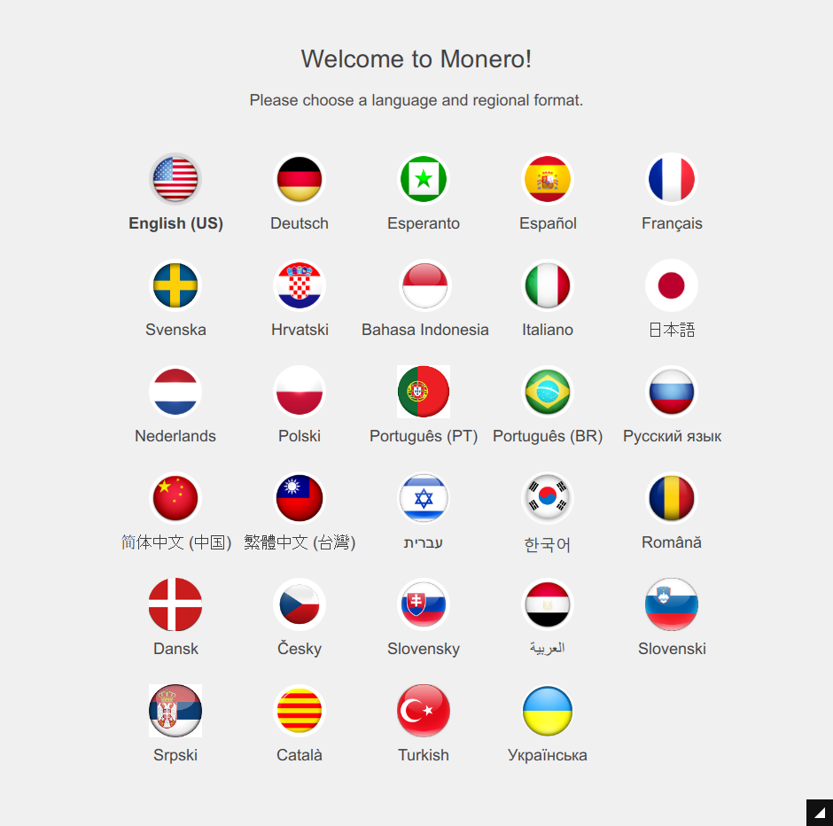
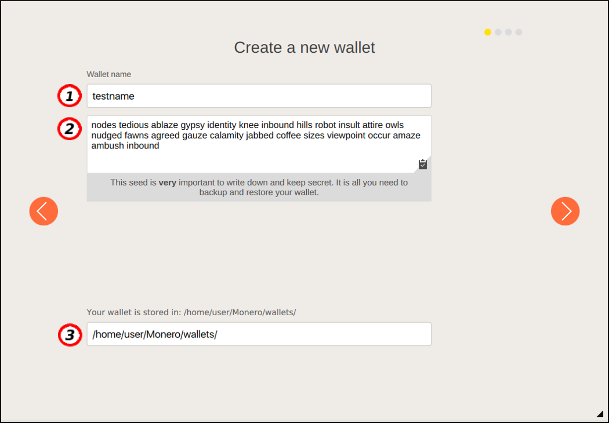
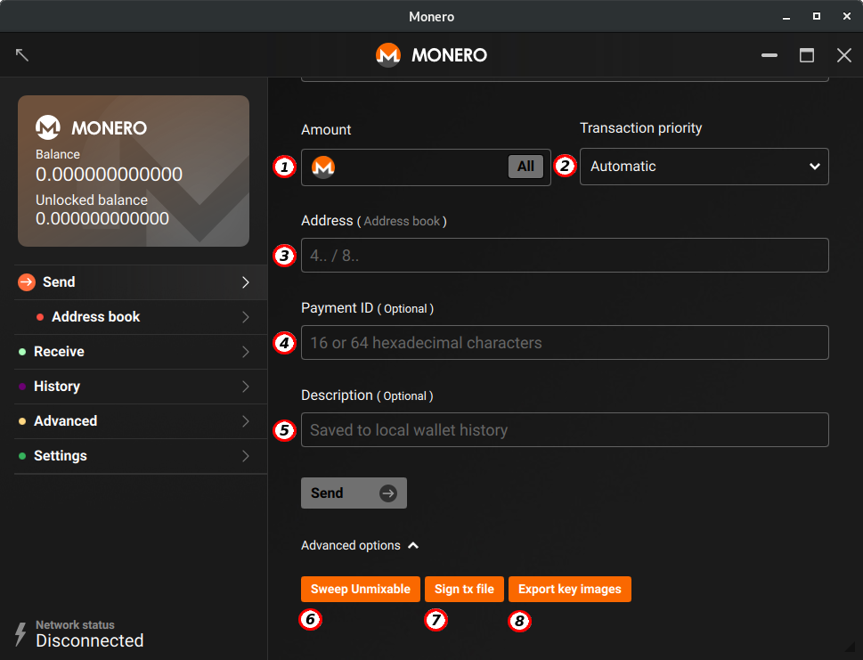
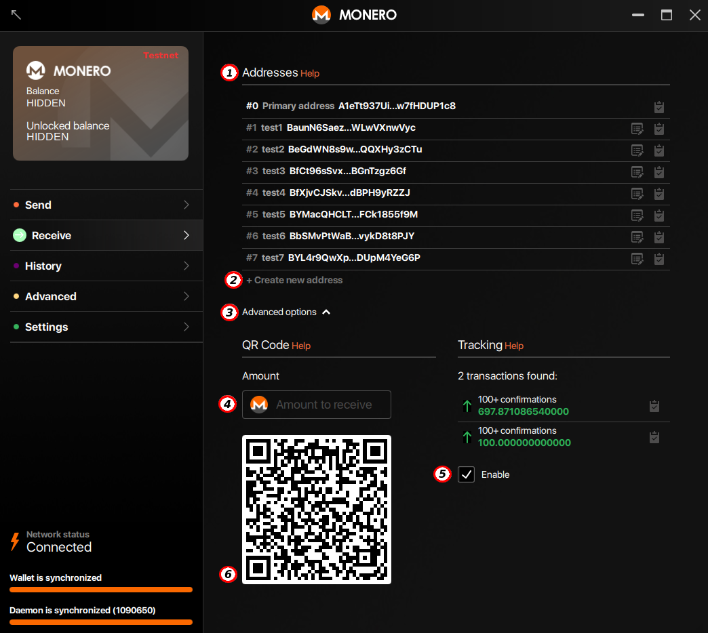
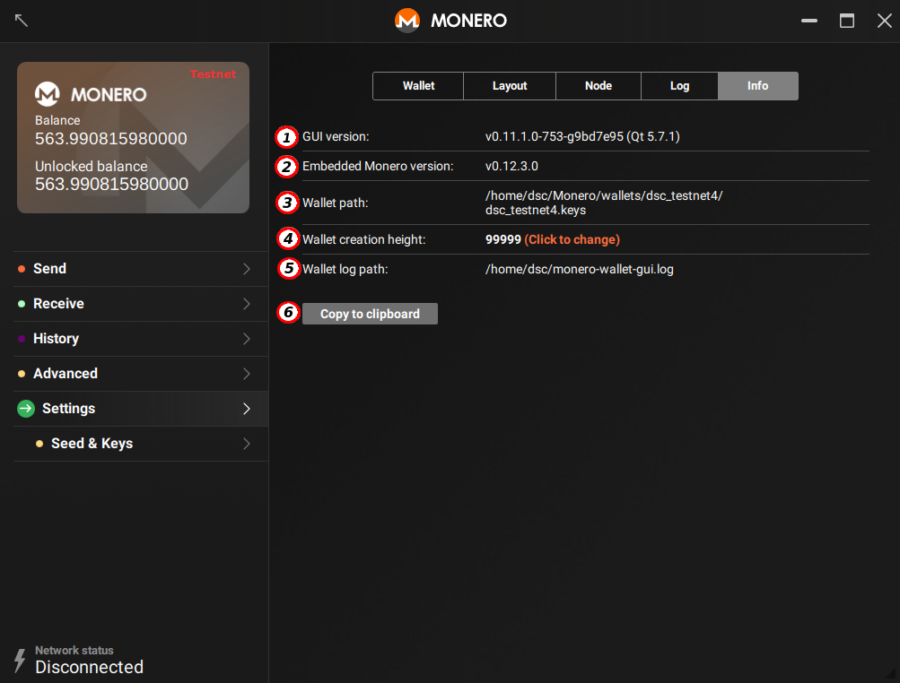

-   [Prefacio](#prefacio)
    -   [Traducciones](#traducciones)
    -   [Preparación en sistemas
        Windows](#preparación-en-sistemas-windows)
    -   [Atajos](#atajos)
-   [Elige un idioma](#elige-un-idioma)
-   [Crea un monedero](#crea-un-monedero)
    -   [Crea un nuevo monedero](#crea-un-nuevo-monedero)
        -   [Añade una contraseña](#añade-una-contraseña)
        -   [Configuración del daemon](#configuración-del-daemon)
        -   [Ejecuta un nodo completo](#ejecuta-un-nodo-completo)
    -   [Restaura un monedero desde claves o semilla
        mnemónica](#restaura-un-monedero-desde-claves-o-semilla-mnemónica)
        -   [Restaurando a partir de una
            semilla](#restaurando-a-partir-de-una-semilla)
        -   [Restaurando desde claves](#restaurando-desde-claves)
    -   [Abre un monedero desde un
        archivo](#abre-un-monedero-desde-un-archivo)
    -   [Crea un nuevo monedero desde un dispositivo
        hardware](#crea-un-nuevo-monedero-desde-un-dispositivo-hardware)
        -   [Crea el monedero](#crea-el-monedero)
-   [Envía Monero](#envía-monero)
    -   [Libreta de direcciones](#libreta-de-direcciones)
-   [Recibe Monero](#recibe-monero)
-   [Características avanzadas](#características-avanzadas)
    -   [Minería en solitario](#minería-en-solitario)
    -   [Probar - verificar](#probar---verificar)
        -   [Prueba una transacción](#prueba-una-transacción)
        -   [Verifica una transacción](#verifica-una-transacción)
    -   [RingDB compartido](#ringdb-compartido)
    -   [Firmar - verificar](#firmar---verificar)
        -   [Firma](#firma)
        -   [Verifica](#verifica)
-   [Ajustes](#ajustes)
    -   [Monedero](#monedero)
    -   [Nodo local](#nodo-local)
    -   [Nodo remoto](#nodo-remoto)
    -   [Registro](#registro)
    -   [Información](#información)
    -   [Semilla y claves](#semilla-y-claves)
-   [Verificación de los binarios](#verificación-de-los-binarios)
-   [Acerca de nodos remoto](#acerca-de-nodos-remoto)
    -   [Nodos Bootstrap](#nodos-bootstrap)
-   [Problemas frecuentes y
    soluciones](#problemas-frecuentes-y-soluciones)

Prefacio
========

Esta guía es código abierto y es una traducción de la guía original en
inglés escrita por ErCiccione, de la comunidad de Monero. Si tienes
sugerencias o quieres contribuir al desarrollo de esta guía, siéntete
libre de abrir un nuevo *Pull Request* con tus cambios o abriendo un
nuevo *Issue* en el repositorio de Github en el que se mantiene este
documento:
[github.com/monero-ecosystem/monero-GUI-guide.](https://github.com/monero-ecosystem/monero-GUI-guide)
 

Para la versión en línea de esta guía, haz clic
[aquí.](https://github.com/monero-ecosystem/monero-GUI-guide/blob/master/monero-GUI-guide.md)

Traducciones
------------

Este documento será localizado en diferentes idiomas. Puedes encontrar
todas las traducciones posibles en [la sección dedicada en
Github.](https://github.com/monero-ecosystem/monero-GUI-guide/translations)

Preparación en sistemas Windows
-------------------------------

Si estás en Windows:

-   Asegúrate de que tu antivirus no bloquee el programa.

-   La primera vez que incicies el monedero deberás darle permisos para
    conectarse a la red a través de un *pop-up.* Haz clic en la opción
    adecuada y selecciona `Permitir acceso` o `Allow access` en función
    del idioma de tu equipo.

Atajos
------

Existen algunos atajos disponibles para hacer la experiencia de usuario
con la interfaz gráfica un poco más sencilla:  

**En todos los sistemas operativos:**\
Presiona `Ctrl` para ver los atajos de cada página. Presiona
`Ctrl + "atajo"` para ir a dicha página.  

**En Linux/Windows:**\
`Ctrl + Tab` -&gt; Ir a la página siguiente\
`Ctrl + Shift + Tab` -&gt; Ir a la página anterior  

**En macOS:**\
`Cmd + Tab` -&gt; Ir a la página siguiente\
`Cmd + Shift + Tab` -&gt; Ir a la página anterior

Elige un idioma
===============

Extrae el paquete y haz clic en `monero-wallet-gui`. Verás un listado
con los idiomas disponibles, haz clic en el idioma de tu elección para
ir al siguiente paso.

Crea un monedero
================

En esta página puede elegir entre tres métodos para acceder a un
monedero y dos opciones para conectarse a la red:

1.  **Crea un nuevo monedero:** Comienza el procedimiento para generar
    un nuevo monedero. Elije esta opción si es la primera vez que usas
    Monero.\
2.  **Restaura el monedero a partir de claves o semillas mnemónicas:**
    Haz clic aquí si deseas recuperar un monedero preexistente
    utilizando la semilla mnemónica o las teclas.\
3.  **Abre un monedero desde archivo:** Elije esta opción para
    seleccionar una cartera preexistente entre tus archivos. Estas se
    identifican por usar la extensión `.keys`.\
4.  **Crear nuevo monedero *hardware***: Crear un nuevo monedero desde
    un dispositivo *hardware* (como Ledger).\
5.  **Mainnet:** *Avanzado* Uso de la red principal de Monero.\
6.  **Testnet:** *Avanzado* Marca esta casilla si quieres usar una red
    de desarrollo en lugar de la red principal. La *testnet* está
    diseñada para permitir a los desarrolladores probar nuevas funciones
    que no están disponibles en la *mainnet* o en la *stagenet*.\
7.  **Stagenet:** *Avanzado* Marca esta casilla si quieres utilizar una
    red alternativa a la red principal. La *stagenet* imita las
    características de la *mainnet* y está diseñada para permitir a los
    usuarios finales probar Monero sin riesgo de perder sus fondos.

Crea un nuevo monedero
----------------------

En este paso se procede a crear un nuevo monedero.

1.  **Nombre:** Da un nombre a tu monedero (en este ejemplo se usa
    `testname`).\
2.  **Semilla mnemónica: Anota tu [semilla
    mnemónica](https://getmonero.org/resources/moneropedia/mnemonicseed.html)
    y mantenla a salvo. Tu semilla es la clave maestra de tu monedero y
    podrás usarla para recuperar tus fondos.**\
3.  **Dirección del monedero:** Directorio de destino donde se
    almacenará el monedero.

### Añade una contraseña

Da una contraseña robusta para proteger tu monedero. Si pierdes tu
contraseña, sólo podrás recuperar tu monedero usando tu semilla
mnemónica.

### Configuración del daemon

En esta ventana puede elegir si quieres ejecutar un nodo completo o usar
uno remoto:

1.  **Iniciar el nodo en segundo plano:** Marca esta casilla para
    ejecutar un nodo completo y comenzar la sincronización de la cadena
    de bloques.\
2.  **Ubicación de la cadena de bloques (opcional):** Desde aquí se
    puede modificar el lugar de almacenamiento de la cadena de bloques.\
3.  **Nodo de arranque:** Para usar un nodo de arranque, introduce el
    *host* y el puerto. Un nodo de arranque permite usar el monedero
    mientras se descarga la cadena de bloques conectándose a un
    nodo remoto. Se pueden encontrar los nodos remotos disponibles en
    [MoneroWorld](https://moneroworld.com/).\
4.  **Conéctate a un nodo remoto:** Marca esta casilla si deseas usar
    solo un nodo remoto sin descargar la cadena de bloques. Deberás
    facilitar el *host* y el puerto del nodo remoto después de marcar
    la casilla.

### Ejecuta un nodo completo

Al completar la configuración inicial, verás una ventana como esta:

Si quieres crear un monedero normal usando un nodo completo personal, no
necesitas hacer nada más que esperar a que la cuenta atrás termine y a
que el nodo el nodo se sincronice completamente.\
Si necesitas algún tipo de configuración adicional, como crear un
monedero de solo lectura o añadir la *blockchain* manualmente, comprueba
la [Sección 6](#6-ajustes).

Restaura un monedero desde claves o semilla mnemónica
-----------------------------------------------------

### Restaurando a partir de una semilla

Restaurar desde tu semilla mnemónica es la forma más fácil de recuperar
tu monedero. Necesitas facilitar la siguiente información:

1.  **Nombre del monedero:** Asigna un nombre a tu monedero (en este
    ejemplo se usa `testname`).\
2.  **Semillas mnemónicas:** Pega tu semilla formada por 25 (o 24)
    palabras.\
3.  **Altura de restauración (opcional):** Si conoces la altura de
    bloque en la que se creó tu monedero, puedes especificarla aquí para
    no tener que escanear toda la cadena de bloques en busca de
    tus fondos. Por ejemplo, si tu primera transacción se incluyó en el
    bloque `1350000`, puedes usar una altura ligeramente más baja (por
    ejemplo,`1330000`) para que la monedero comience a escanear desde
    allí, ahorrando tiempo.\
4.  **Ubicación del monedero:** Selecciona la carpeta de destino
    del monedero.

Una guía detallada está disponible en getmonero.org: ['Cómo restaurar tu
cuenta'](https://www.getmonero.org/es/resources/user-guides/restore_account.html).

### Restaurando desde claves

La restauración desde las claves es bastante sencilla y puede ser
extremadamente útil, especialmente si mueves tu monedero desde un
servicio en línea como MyMonero. Necesitas facilitar la siguiente
información:

1.  **Nombre del monedero:** Asigna un nombre a tu monedero (en este
    ejemplo se usa `testname`).\
2.  **Dirección de la cuenta:** La dirección de la monedero que estás
    recuperando.\
3.  **Clave de vista:** Tu clave de vista privada (necesaria para poder
    verificar tus fondos).\
4.  **Clave de gasto:** Tu clave de gasto privado (necesaria para gastar
    tus fondos).\
5.  **Altura de restauración (opcional):** Si conoces la altura de
    bloque en la que se creó tu monedero, puedes especificarla aquí para
    no tener que escanear toda la cadena de bloques en busca de
    tus fondos. Por ejemplo, si tu primera transacción se incluyó en el
    bloque `1350000`, puedes usar una altura ligeramente más baja (por
    ejemplo,`1330000`) para que la monedero comience a escanear desde
    allí, ahorrando tiempo.\
6.  **Ubicación del monedero:** Seleccione la carpeta de destino de
    la cartera.

Cuando todo esté listo, haz clic en la flecha derecha y luego en el
botón `Usar Monero`. En getmonero.org se pone a disposición de los
usuarios una guía más avanzada: [Restaurar monedero desde
claves](https://www.getmonero.org/es/resources/user-guides/restore_from_keys.html).

Abre un monedero desde un archivo
---------------------------------

Después de hacer clic en esta opción aparecerá una nueva ventana en la
que podrás elegir el fichero con extensión `.keys` de tu monedero.
Selecciónalo y haz clic en la flecha derecha.

Crea un nuevo monedero desde un dispositivo hardware
----------------------------------------------------

### Crea el monedero

1.  **Nombre del monedero:** Asigna un nombre a tu monedero (en este
    ejemplo se usa `testname`).\
2.  **Altura de restauración (opcional):** Si conoces la altura de
    bloque en la que se creó tu monedero, puedes especificarla aquí para
    no tener que escanear toda la cadena de bloques en busca de
    tus fondos. Por ejemplo, si tu primera transacción se incluyó en el
    bloque `1350000`, puedes usar una altura ligeramente más baja (por
    ejemplo,`1330000`) para que la monedero comience a escanear desde
    allí, ahorrando tiempo.\
3.  **Pregenerar subdirecciones (opcional):** pregenera un número de
    cuentas con un número de subdirecciones cada una\
4.  **Nombre del dispositivo:** Selecciona el monedero hardware que
    quieres usar (por el momento, sólo 'Ledger' está disponible)\
5.  **Ubicación del monedero:** Selecciona la carpeta de destino de
    la cartera.  

Todos los pasos siguientes son iguales que los explicados desde
[2.1.1](#211-añade-una-contraseña) hasta
[2.1.3](#213-ejecuta-un-nodo-completo)  

Una guía paso a paso para generar un monedero Ledger con Monero GUI para
todos los sistemas operativos (StackExchange, en inglés):\
[How do I generate a Ledger Monero wallet with the GUI
(monero-wallet-gui)?](https://monero.stackexchange.com/questions/9901/how-do-i-generate-a-ledger-monero-wallet-with-the-gui-monero-wallet-gui)

Envía Monero
============

La pestaña `Enviar` proporciona herramientas para crear transacciones de
salida.

1.  **Cantidad:** Esta es la cantidad de Monero que quieres enviar.\
2.  **Prioridad de transacción:** Este es el nivel de prioridad que la
    transacción recibirá con respecto al conjunto de transacciones que
    esperan ser confirmadas. Cuanto más se pague, mayor será la
    prioridad de esta transacción para su inclusión en un bloque.
    *Actualmente, es probable que el uso de la opción predeterminada o
    lenta la incluya en el próximo bloque.*\
3.  **Dirección:** Aquí es donde se ingresa la dirección de Monero a la
    que se envían los moneroj. La mejor práctica es copiar y pegar la
    dirección para evitar errores, acompañada de una comprobación visual
    de que la dirección pegada es correcta.\
4.  **ID de pago (opcional):** El ID de pago es un identificador adjunto
    a la transacción que estás a punto de enviar. A menudo, al enviar a
    un mercado de intercambio, te facilitarán una identificación de pago
    que tendrás que incluir aquí. Esta medida suele ser necesaria para
    que el receptor sepa que la transacción entrante es tuya.\
    *Si olvidas agregar tu ID de pago, aún podrás recuperar tus fondos
    comunicándote con la parte a la que enviaste Monero.*\
5.  **Descripción (opcional):** Esta descripción es para un
    registro personal. Puedes agregar alguna información con respecto al
    motivo de la transacción para referencias futuras.\
6.  **Barrido no se puede mezclar:** Esta función permite deshacerse de
    las salidas en tu monedero que tienen cantidades extrañas como
    `0.000006839355`. Estos son inamovibles sin combinarlos con
    otra salida. *La mayoría de los usuarios nunca necesitarán usar
    esta función.*\
7.  **Firmar archivo tx:** Este botón te permite firmar un archivo de
    transacción que se hubiera creado en una monedero de solo lectura.
8.  **Export key images:** This option will allow you to export your
    key images. They are needed to get the true balance of a
    view-only wallet.

Libreta de direcciones
----------------------

La pestaña de la `Libreta de direcciones` te permite guardar direcciones
con las que interactúas de forma frecuente. Este es un lugar conveniente
desde el que copiar las direcciones cuando crees nuevas transacciones.

Recibe Monero
=============

La pestaña de `Recibir` facilita herramientas para generar
subdirecciones, preparar solicitudes de pago y monitorizar las
transacciones entrantes.

1.  **Direcciones:** Esta es una lista que incluye tu dirección
    principal y diferentes subdirecciones.
2.  **Crear nueva dirección:** Este botón te permite crear
    nuevas subdirecciones. Puedes crear tantas como quieras. *Obtén más
    información sobre las subdirecciones en [este enlace
    \[EN\]](https://monero.stackexchange.com/questions/3673/what-is-a-sub-address).*\
3.  **Opciones avanzadas:** Hacer clic aquí te preguntará si quieres ir
    a las opciones avanzadas.\
4.  **Cantidad:** Se utiliza para crear una solicitud de pago,
    ingresando la cantidad de Monero que deseas recibir.\
5.  **Seguimiento:** Esta es una lista de transacciones entrantes.\
6.  **Código QR:** Este es un código QR que contiene incrustado en él la
    dirección seleccionada y, opcionalmente, la cantidad solicitada.
    Puede usarse como una forma de dar a otros su dirección de Monero
    escaneando el código.

Características avanzadas
=========================

Minería en solitario
--------------------

La pestaña de minería facilita un minero de CPU de un solo clic que está
incluido en la propia interfaz gráfica.

1.  **Hilos de CPU :** Número de hilos de la CPU a utilizar para minar.\
2.  **Minería en segundo plano:** Haz clic en esta opción para permitir
    el minado en segundo plano experimental. Esta opción debería
    permitirte usar tu equipo mientras minas.\
3.  **Empezar a minar:** Arranca el minero.\
4.  **Parar de minar:** Para el minero.

Probar - verificar
------------------

La pestaña `Probar/verificar` facilita herramientas para acreditar un
pago o validar la prueba facilitada de un pago. Este proceso es
necesario en Monero porque los detalles de una transacción no están
disponibles en la *blockchain*.

### Prueba una transacción

Esta acción generará una prueba de que se realizó un pago a una
dirección determinada. Necesitas introducir la siguiente información:

1.  **ID de transacción:** Este es el ID de pago para el que se está
    creando la prueba. Puedes encontrar los detalles de la transacción
    seleccionando la pestaña `Historial` en el menú de la izquierda.\
2.  **Dirección:** Esta es la dirección a la que se quiere demostrar el
    pago.\
3.  **Mensaje (opcional):** Este es un mensaje opcional que se firmará
    junto con los detalles de la transacción. Si eliges incluir un
    mensaje, la otra parte también debe incluir exactamente el mismo
    mensaje para verificar tu prueba.\
4.  **Generar:** Haz clic aquí una vez que haya ingresado todos los
    detalles para generar la acreditación del pago.  

Una guía detallada está disponible en getmonero.org: ['Cómo comprobar un
pago'](https://www.getmonero.org/es/resources/user-guides/prove-payment.html).

### Verifica una transacción

En esta sección podrás verificar la realización de un un pago. Necesitas
introducir la siguiente información:

5.  **ID de transacción:** Este es el ID del pago que estás intentando
    verificar.\
6.  **Dirección:** Esta es la dirección de recepción del pago que estás
    intentando verificar.\
7.  **Mensaje (opcional):** Este es el mensaje opcional que puede haber
    sido incluido junto con la prueba.
8.  **Firma:** Esta es la firma generada para probar un pago.\
9.  **Verificar:** Haz clic aquí una vez que hayas introducido la
    información anterior para verificar si la prueba de la transacción
    facilitada es válida.

RingDB compartido
-----------------

Esta es una herramienta avanzada que puede ser usada para mejorar la
privacidad de las firmas circulares. Las salidas usadas en firmas
circulares pueden adaptarse para mitigar una pérdida de privacidad
cuando se usa un fork de claves reusadas o para evadir salidas que no
pueden ser gastadas en esa transacción.

1.  **Nombre de archivo marcado como gastado:** Esta herramienta marcará
    como gastadas las salidas que se sabe que serán gastadas. Después de
    ejecutar monero-blockchain-blackball, importa el archivo resultante
    para evitar usar estas salidas como señuelo en firmas
    circulares construidas. Este archivo se guarda en la carpeta
    .shared-ringdb por defecto.\
2.  **Salida marcada como gastada:** Esto marcará o desmarcará una sola
    salida seleccionada. Las salidas son representadas por una cadena de
    64 caracteres. Las salidas agregadas en este campo no serán
    utilizadas como señuelo en firmas circulares construidas. Salidas no
    marcadas como gastadas pueden (pero no necesariamente) ser usadas
    como señuelo.\
3.  **Entrada de clave imagen:** Agrega la clave imagen que fue usada en
    el fork de claves reusadas.\
4.  **Obtener círculo:** Presiona el botón "Get Ring" para obtener los
    miembros circulares para la clave imagen dada en el paso 3.\
5.  **Establecer círculo:** Presiona el botón "Set Ring" para establecer
    los miembros circulares para una transacción. Copia los miembros
    circulares de 4 para obtenerlos para la clave imagen, o escribe
    manualmente tus propios miembros circulares.\
6.  **Intento de gastar:** Elije esto si estás seguro que gastarás
    Monero en un fork de claves reusadas. Esto modificará agresivamente
    el algoritmo de selección de entrada para otorgarte la más grande
    negación plausible.\
7.  **Posibilidad de gastar:** Elije esto si puedes gastar monero en un
    fork de claves reusadas. Esto modificará el algoritmo de selección
    de entrada. Deselecciona esto sólo si estás seguro de que no usarás
    un fork de claves reusadas.\
8.  **Relativo:** Seleccionado, las compensaciones están codificadas en
    relación a las anteriores, al contrario que al absoluto (las
    transacciones usan compensaciones relativas).\
9.  **Altura de segregación:** La altura del bloque a la cual el fork de
    claves reusadas se parte.

Firmar - verificar
------------------

La pestaña de `Firmar/Verificar` facilita herramientas para firmar un
mensaje o fichero con tu clave privada y verificar la autenticidad del
mensaje o fichero.

### Firma

1.  **Mensaje:** Aquí es donde se introduce un mensaje para firmar.\
2.  **Mensaje del archivo:** Aquí se puede elegir un archivo
    para firmar. Haz clic en `Examinar` para navegar por el sistema de
    archivos.\
3.  **Firma:** Aquí es donde se mostrará la firma única una vez que se
    haya hecho clic en el botón de `Firmar` de los apartados anteriores.
    La firma del mensaje o archivo que se haya facilitado es realizada
    con la clave privada del monedero. Esta firma se pueded entregar
    como prueba junto con el mensaje o archivo en cuestión.

### Verifica

4.  **Verificar mensaje:** Aquí es donde se coloca un mensaje que ha
    sido firmado.\
5.  **Verificar archivo:** Aquí es donde se ingresa la ruta a un archivo
    que se ha firmado. Haz clic en `Examinar` para navegar por el
    sistema de archivos.\
6.  **Dirección:** Aquí es donde se introduce la dirección pública de
    Monero del firmante.\
7.  **Firma:** Aquí es donde se introduce la firma que está verificando.
    Una vez que se haya ingresado toda la información requerida, es
    necesario hacer clic en el botón de `Verificar`. Una ventana
    emergente certificará si la firma es válida.

Ajustes
=======

La pestaña de `Ajustes` facilita herramientas para configurar las
diferentes opciones de la aplicación.

### Monedero

### Nodo local

1.  **Iniciar/Detener Nodo local:** Dependiendo del estado actual,
    inicia o detiene el nodo local.\
2.  **Ubicación de la cadena de bloques:** Ingresa manualmente una
    dirección no predeterminada para la cadena de bloques.\
3.  **Marcadores de inicio:** Al usar un nodo local, esto será en donde
    ingreses opciones de interfaz de línea de comandos.\
4.  **Dirección Bootstrap:** Ingresa un nombre de host o dirección IP
    del nodo remoto del bootstrap. Ve la sección [8.1 Nodos
    Bootstrap](#81-nodos-bootstrap) para una breve explicación de qué es
    un nodo bootstrap.\
5.  **Puerto Bootstrap:** Ingresa el puerto del nodo remoto
    del bootstrap.

### Nodo remoto

Usa un nodo remoto, no descargues la cadena de bloques. Ve la Check the
[sección 'Acerca de nodos remotos'](#8-acerca-de-nodos-remotos) de esta
guía.

1.  **Dirección:** Ingresa el nombre de host o dirección IP del nodo
    remoto.\
2.  **Puerto:** Ingresa el puerto del nodo remoto.\
3.  **Nombre de usuario daemon:** ingresa un nombre de usuario en caso
    de que se requiera autentificación para el nodo remoto.\
4.  **Contraseña daemon:** ingresa una contraseña en caso de que se
    requiera autentificación para el nodo remoto.

### Registro

1.  **Nivel de registro:** Cambia la verbosidad del registro de
    depuración.\
2.  **Categorías de registro:** Agregar categorías específicas a los
    registros de depuración.\
3.  **Registro del daemon:** Salida a tiempo real del registro.\
4.  **Interfaz de línea de comandos:** Interactuar con el daemon.

### Información

1.  **Versión GUI:** Versión del monedero GUI installado.\
2.  **Versión Monero embedida:** Versión del daemon embedido en uso.\
3.  **Dirección del monedero:** Donde se localiza el monedero en tu
    ordenador.\
4.  **Altura de creación del monedero:** Cambia la altura del bloque a
    la que un monedero volverá a escanear.\
5.  **Dirección del registro del monedero:** Donde los registros para
    este monedero serán guardados.\
6.  **Copiar al portapapeles:** Copia toda esta información
    al portapapeles.

Semilla y claves
----------------

La pestaña `Semillas y claves` muestra la información mnemónicas de tu
monedero, así como tu clave de vista secreta, clave de vista pública,
clave de gasto secreta y clave de gasto público.

1.  **Semilla mnemónica: NO comparta su semilla mnemónica con nadie.
    Guarde una copia de forma segura.** La semilla mnemónica es una
    frase de 25 palabras que contiene toda la información necesaria para
    ver y gastar fondos. *Obtén más información sobre las semillas
    mnemónicas en Monero en
    \[este enlace\]\](https://www.getmonero.org/es/resources/moneropedia/mnemonicseed.html).*\
2.  **Clave de vista secreta:** Las claves de vista secretas permiten al
    titular ver las transacciones entrantes de su monedero, pero no
    las salientes. A veces esta funcionalidad es útil para permitir que
    un tercero pueda auditar y comprobar las transacciones entrantes.\
3.  **Clave de vista pública:** Las claves de vista públicas se usan
    para la creación de direcciones ocultas. *Obtén más información
    sobre las claves en [este enlace
    \[EN\]](https://getmonero.org/resources/moneropedia/viewkey.html).*\
4.  **Clave secreta de gastos: NO comparta su clave secreta de gastos
    con nadie. La clave de gasto secreta se usa para firmar
    transacciones y debe protegerse con un nivel de seguridad
    equivalente al de su semilla mnemónica.**\
5.  **Clave de gasto público:** La red utiliza la clave de gasto pública
    para verificar la firma de la imagen de clave que se genera cuando
    realiza una transacción. Esto evita la presencia del doble gasto ya
    que la red obliga a que una clave de imagen solo pueda gastarse
    una vez. *Obtén más información sobre las claves de gasto en [este
    enlace](https://www.getmonero.org/es/resources/moneropedia/spendkey.html).*\
6.  **Exportar monedero gastable: NO compartas tu código QR del monedero
    con nadie. Esto puede usarse como una semilla mnemónicas para
    recuperar su monedero.** Esta opción crea un código QR que contiene
    todas sus claves.\
7.  **Exportar solo monedero de vista:** Esta opción crea un código QR
    que contiene solo las claves para ver las transacciones que este
    monedero envía o recibe, pero no puede crear y
    generar transacciones.

Verificación de los binarios
============================

Verifica que los ficheros que descargaste correspondan con los ficheros
oficiales. Puedes utilizar [esta guía
paso-a-paso](https://www.getmonero.org/es/resources/user-guides/verification-windows-beginner.html)
con imágenes (fácil, para usuarios Windows).

Acerca de nodos remoto
======================

Los nodos remotos pueden ser muy útiles si no eres capaz o no deseas
descargar la cadena de bloques completa, pero hemos advertido que nodos
remotos maliciosos pueden comprometer el nivel de privacidad de tu
transacción, rastreando tu dirección IP, o, en casos extremos, mostrando
incluso la cantidad de la transacción. Dicho esto, una lista de nodos
remotos puede encontrarse en [moneroworld.com](https://moneroworld.com).
Mantén en mente que cualquiera es capaz de agregar un nodo a esa lista,
no debes considerar esos nodos como seguros o confiables, siempre
ejecuta tu propio nodo para la mejor privacidad.

Nodos Bootstrap
---------------

Un nodo bootstrap es un nodo remoto para usar mientras también se
sincroniza la cadena de bloques. Esto difiere a un nodo remoto en que
usar un nodo remoto no sincronizará la cadena de bloques a un nodo
local.\
Si se utiliza la característica de nodo bootstrap automáticamente se
cambiará al nodo local cuando la cadena de bloques se sincronice
totalmente, independientemente de si el usuario eligió el nodo remoto
por él mismo o el nodo remoto se especificó por defecto.\
Más información en
https://getmonero.org/es/resources/moneropedia/bootstrap-node.html.

Problemas frecuentes y soluciones
=================================

-   **[\[EN\] He perdido (no estoy viendo) una transacción entrante en
    la interfaz gráfica
    (balance cero)](https://monero.stackexchange.com/questions/6640/i-am-missing-not-seeing-a-transaction-to-in-the-gui-zero-balance)**
-   **[\[EN\] Uso la interfaz gráfica y mi daemon ha dejado de
    arrancar](https://monero.stackexchange.com/questions/6825/i-am-using-the-gui-and-my-daemon-doesnt-start-anymore)**
-   **[\[EN\] La transacción está bloqueada como *pendiente* en la
    interfaz
    gráfica](https://monero.stackexchange.com/questions/6649/transaction-stuck-as-pending-in-the-gui)**
-   **[\[EN\] La interfaz gráfica parece que tiene errores o se congela
    todo el
    rato](https://monero.stackexchange.com/questions/6651/my-gui-feels-buggy-freezes-all-the-time)**
-   **[\[EN\] Mi nombre contiene caracteres especiales (non-ASCII) (e.g.
    é, ø, â, Ö) y no puedo crear un monedero en la interfaz
    gráfica](https://monero.stackexchange.com/questions/6823/my-name-contains-a-special-non-ascii-character-e-g-%c3%a9-%c3%b8-%c3%a2-%c3%96-and-i-cant-c)**
-   **[\[EN\] La interfaz gráfica usa todo mi ancho de banda y no puedo
    navegar o usar otras aplicaciones que requieran conexión a
    internet](https://monero.stackexchange.com/questions/6653/the-gui-uses-all-my-bandwidth-and-i-cant-browse-anymore-or-use-another-applicat)**
-   **[\[EN\] ¿Cómo puedo mover la cadena de bloques (`data.mdb`) a un
    directorio diferente durante (o después) de la sincronización
    inicial sin perder el
    progreso?](https://monero.stackexchange.com/questions/7225/how-do-i-move-the-blockchain-data-mdb-to-a-different-directory-during-or-afte)**
-   **[\[EN\] ¿Cómo puedo cambiar el idioma de las 25 palabras de la
    semilla mnemónica en la interfaz gráfica y en la
    terminal?](https://monero.stackexchange.com/questions/7373/how-do-i-change-the-language-of-the-25-word-mnemonic-seed-in-the-gui/)**
-   **[\[EN\] Mi cadena de bloques está bloqueada, ¿cómo la
    desbloqueo?](https://monero.stackexchange.com/questions/4462/my-blockchain-is-stuck-how-do-i-unstuck-it)**
-   **[\[EN\] Estoy usando un nodo remoto pero, ¿por qué sigue
    sincronizándose la cadena de bloques en la interfaz
    gráfica?](https://monero.stackexchange.com/questions/6324/using-remote-node-still-syncs-blockchain)**
-   **Utilizo una pantalla de alta resolución y la interfaz gráfica
    parece extremadamente pequeña**\
    Este problema será resuelto próximamente, pero se puede solucionar
    temporalmente en Windows: haz clic con botón derecho en
    `monero-wallet-gui.exe`, selecciona `Propiedades` --&gt;
    `Compatibilidad`. En la opción de alta resolución (`high DPI`),
    cambia el valor de `Aplicación` a `Sistema` o viceversa.

