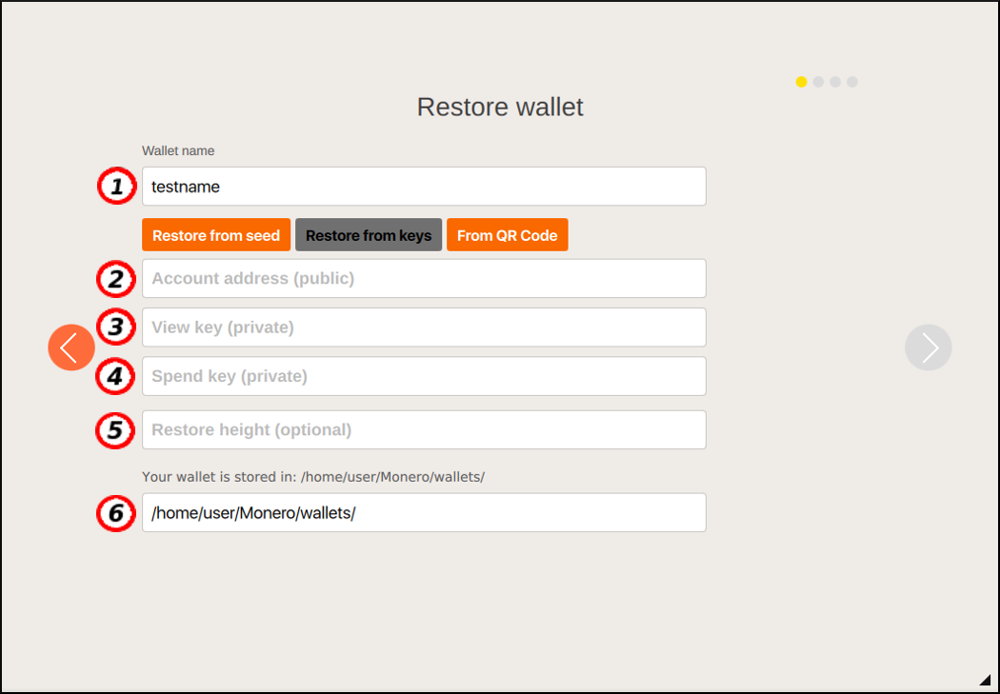
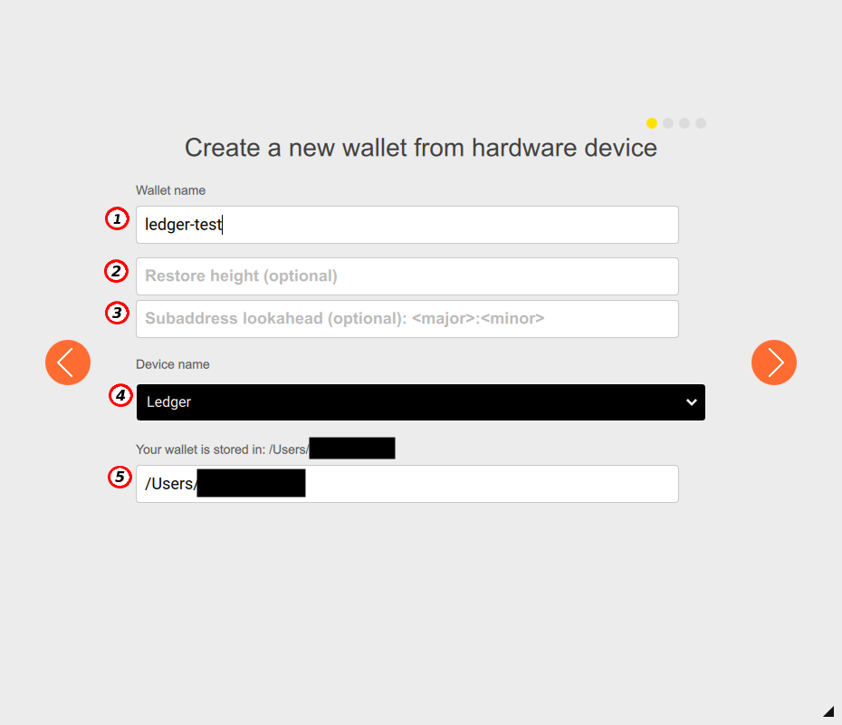
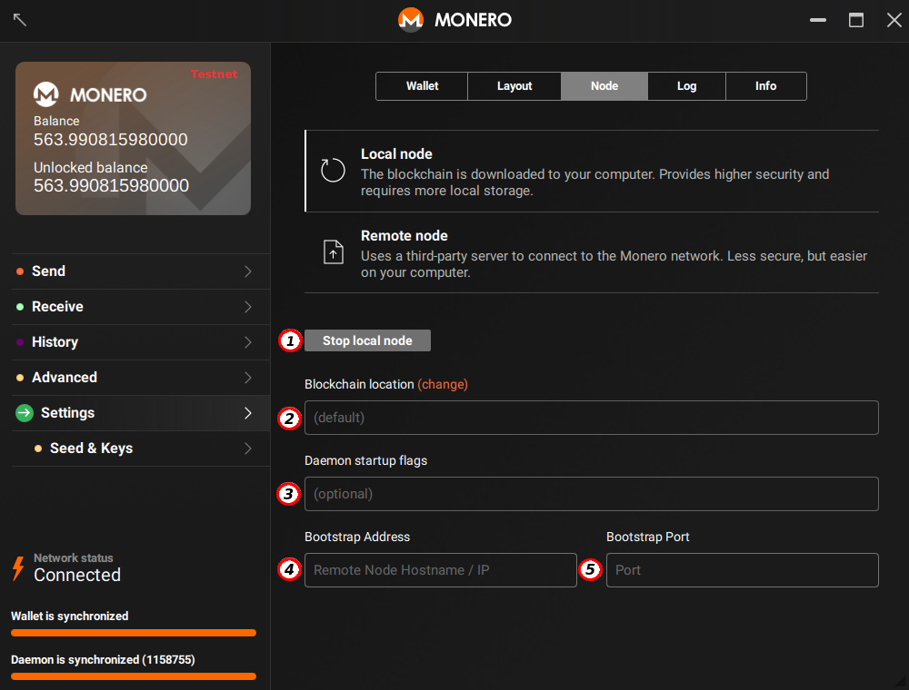
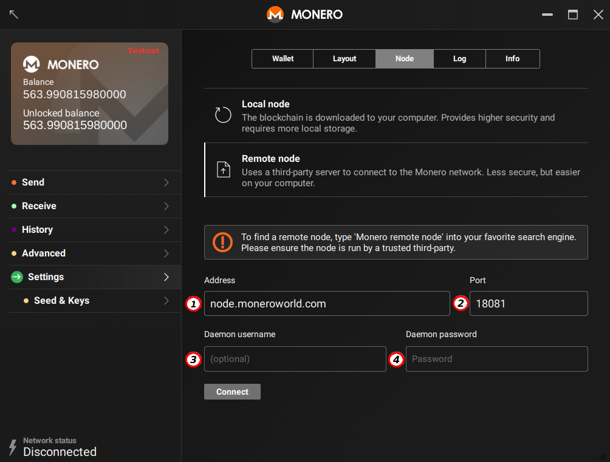
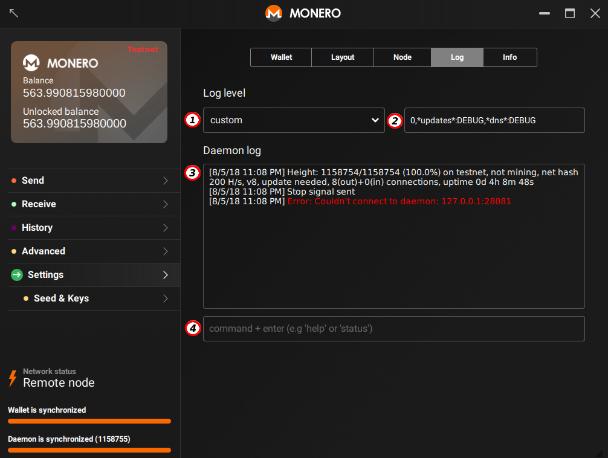
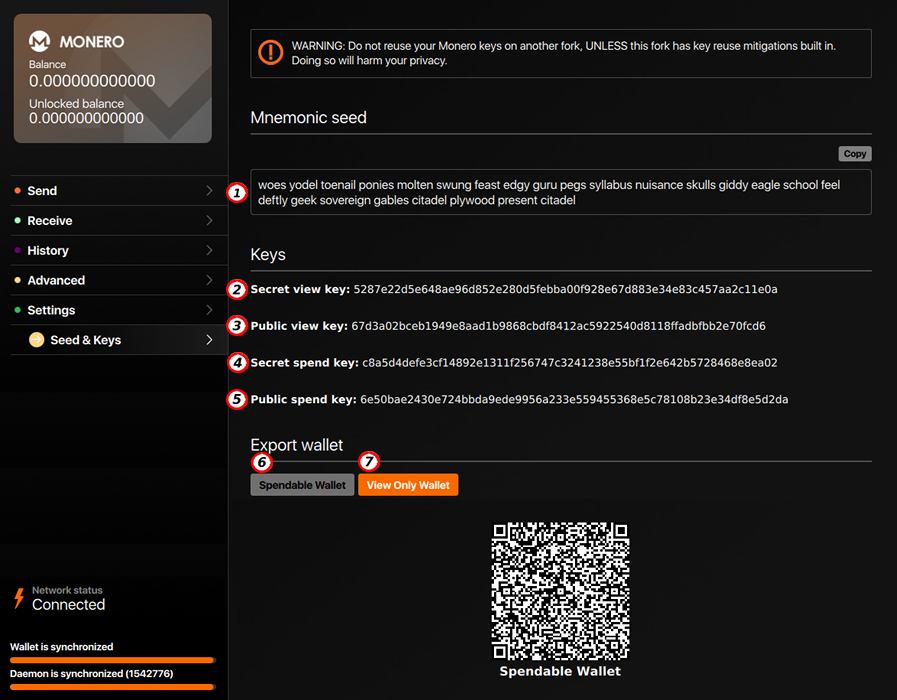

-   [Préface](#préface)
    -   [Traductions](#traductions)
    -   [Préparations Windows](#préparations-windows)
    -   [Raccourcis](#raccourcis)
-   [Choisir une langue](#choisir-une-langue)
-   [Créer un Portefeuille](#créer-un-portefeuille)
    -   [Créer un nouveau portefeuille](#créer-un-nouveau-portefeuille)
        -   [Ajouter un mot de passe](#ajouter-un-mot-de-passe)
        -   [Paramètres du démon](#paramètres-du-démon)
        -   [Faire fonctionner un nœud
            complet](#faire-fonctionner-un-nœud-complet)
    -   [Restaurer un portefeuille à partir des clés ou de la phrase
        mnémonique](#restaurer-un-portefeuille-à-partir-des-clés-ou-de-la-phrase-mnémonique)
        -   [Restaurer à partir de la phrase
            mnémonique](#restaurer-à-partir-de-la-phrase-mnémonique)
        -   [Restaurer à partir des clés](#restaurer-à-partir-des-clés)
    -   [Ouvrir fichier portefeuille](#ouvrir-fichier-portefeuille)
    -   [Créer un portefeuille depuis un périphérique
        matériel](#créer-un-portefeuille-depuis-un-périphérique-matériel)
        -   [Créer le portefeuille](#créer-le-portefeuille)
-   [Envoyer des Moneroj](#envoyer-des-moneroj)
    -   [Carnet d'adresses](#carnet-dadresses)
-   [Recevoir des Moneroj](#recevoir-des-moneroj)
-   [Fonctionnalités avancées](#fonctionnalités-avancées)
    -   [Extraction minière en solo](#extraction-minière-en-solo)
    -   [Prouver/Vérifier](#prouvervérifier)
        -   [Prouver la transaction](#prouver-la-transaction)
        -   [Vérifier la transaction](#vérifier-la-transaction)
    -   [Base de données partagées de
        cercles](#base-de-données-partagées-de-cercles)
    -   [Signer/vérifier](#signervérifier)
        -   [Signer](#signer)
        -   [Vérifier](#vérifier)
-   [Réglages](#réglages)
    -   [Portefeuille](#portefeuille)
    -   [Nœud local](#nœud-local)
    -   [Nœud distant](#nœud-distant)
    -   [Journal](#journal)
    -   [Info](#info)
    -   [Phrase mnémonique & Clés](#phrase-mnémonique-clés)
-   [Vérification des binaires](#vérification-des-binaires)
-   [À propos des nœuds distants](#à-propos-des-nœuds-distants)
    -   [Nœuds d'amorçage](#nœuds-damorçage)
-   [Problèmes fréquents et
    solutions](#problèmes-fréquents-et-solutions)

Préface
=======

Version: 1.5
&nbsp;

Ce guide est open-source et maintenu par Erciccione de la communauté
Monero. Si vous avez des suggestions ou des souhaits pour contribuer au
développement de ce guide, n'hésitez pas à ouvrir des `Pull Requests` ou
des `Issues` sur le dépôt GitHub où ce guide est maintenu :
[github.com/monero-ecosystem/monero-GUI-guide](https://github.com/monero-ecosystem/monero-GUI-guide).
 

Pour une version en ligne de ce guide, cliquez
[ici](https://github.com/monero-ecosystem/monero-GUI-guide/tree/master/translations/monero-GUI-guide_fr.md)

Traductions
-----------

Ce document sera traduit dans diverses langues. Vous trouverez toutes
les traductions disponibles dans la [section dédiée sur
GitHub](https://github.com/monero-ecosystem/monero-GUI-guide/tree/master/translations).

Préparations Windows
--------------------

Si vous êtes sur Windows :

-   Assurez-vous que votre antivirus ne bloque pas le programme.
-   La première fois que vous démarrerez le portefeuille vous devrez lui
    donner la permission de se connecter au réseau à travers une
    fenêtre contextuelle. Cochez les cases adéquates et cliquez sur
    `Autoriser l'accès`.

Vérification pare-feu Windows

Raccourcis
----------

Quelques raccourcis sont disponibles pour rendre l'expérience
utilisateur plus simple avec la GUI :  

**Sur tous les systèmes d'exploitation :**\
Appuyez sur `Ctrl` pour voir les raccourcis de chaque page. Appuyez sur
`ctrl + "raccourci"` pour aller sur cette page  

**Sur Linux / Windows :**\
`ctrl + tab` -&gt; Aller à la page suivante\
`ctrl + shift + tab` -&gt; Aller à la page précédente  

**Sur macOS :**\
`cmd + tab` -&gt; Aller à la page suivante\
`cmd + shift + tab` -&gt; Aller à la page précédente

Choisir une langue
==================

Langue

Décompressez l'archive et cliquez sur `monero-wallet-gui`. Vous verrez
une liste de langues disponibles, cliquez sur celle de votre choix et
passez à l'étape suivante.

Créer un Portefeuille
=====================

bienvenu

Sur cette page vous pouvez choisir comment accéder à un portefeuille et
vous connecter au réseau :

1.  **Créer un nouveau portefeuille :** Démarre le processus de création
    d'un nouveau portefeuille. Choisissez cette option si c'est la
    première fois que vous utilisez Monero.\
2.  **Restaurer un portefeuille à partir des clés ou de la phrase
    mnémonique :** Cliquez ici si vous voulez récupérer un portefeuille
    pré-existant en utilisant une phrase mnémonique ou des clés.\
3.  **Ouvrir un fichier portefeuille :** Choisissez cette option pour
    sélectionner un fichier de portefeuille pré-existant ayant
    l'extension `.keys`.\
4.  **Créer un nouveau portefeuille depuis un périphérique matériel :**
    Créer un nouveau portefeuille à partir d'un périphérique physique
    (comme Ledger)\
5.  **Mainnet:** *Options avancées :* Utilisez le réseau Monero
    principal\
6.  **Testnet:** *Options avancées :* Cochez cette case si vous
    souhaitez utiliser un réseau de développement à la place du
    réseau principal. Le Testnet est conçu pour permettre aux
    développeurs de tester de nouvelles fonctionnalités qui ne sont pas
    disponibles sur les Mainnet ou Stagenet.\
7.  **Stagenet:** *Options avancées :* Cochez cette case si vous
    souhaitez utiliser un réseau de préparation à la place du
    réseau principal. Le Stagenet copie les fonctionnalités du Mainnet
    et est conçu pour permettre aux utilisateurs de tester Monero sans
    risquer de perdre des fonds.

Créer un nouveau portefeuille
-----------------------------

nouveau

Ici vous pouvez créer un nouveau portefeuille :

1.  **Nom du portefeuille :** Donnez un nom à votre portefeuille (dans
    cet exemple, `testname` est utilisé).\
2.  **phrase mnémonique : Notez votre [phrase
    mnémonique](https://getmonero.org/fr/resources/moneropedia/mnemonicseed.html)
    et conservez la en sécurité. Votre phrase mnémonique est la clé
    principale de votre portefeuille, vous pouvez l'utiliser pour
    récupérer vos fonds.**\
3.  **Emplacement du portefeuille :** Choisissez le répertoire de
    destination pour le portefeuille.

### Ajouter un mot de passe

ajouter mot de passe

Ajoutez un mot de passe fort pour protéger votre portefeuille. Si vous
perdez votre mot de passe, alors seule votre phrase mnémonique permettra
de récupérer votre portefeuille.

### Paramètres du démon

paramètres du démon

Ici vous pouvez choisir si vous allez faire fonctionner un nœud complet
ou en utiliser un distant :

1.  **Lancer un démon automatiquement en arrière-plan :** Cochez cette
    case pour lancer un nœud complet et démarrer la synchronisation de
    la chaîne de blocs.\
2.  **Emplacement de la chaîne de blocs (optionnel) :** Pour stocker la
    chaîne de blocs ailleurs que dans l'emplacement par défaut, entrez
    cet emplacement ici.\
3.  **Nœud d'amorçage :** Pour utiliser un nœud d'amorçage, entrez le
    nom d'hôte et le port. Un nœud d'amorçage vous permet d'utiliser
    votre portefeuille tandis que vous téléchargez la chaîne de blocs en
    vous connectant à un nœud distant. Pour une liste de nœuds distants
    disponibles et des infos sur eux, consultez la section [À propos des
    nœuds distants](#8a-propos-des-nœuds-distants) de ce guide.\
4.  **Se connecter à un nœud distant :** Cochez cette case si vous
    voulez utiliser uniquement un nœud distant sans télécharger la
    chaîne de blocs. Vous aurez besoin d'indiquer le nom d'hôte et le
    port de ce nœud distant après avoir coché cette case.

### Faire fonctionner un nœud complet

Une fois l'installation terminée vous serez invité à accéder au menu des
paramètres, mais vous verrez d'abord apparaître une fenêtre comme
celle-ci :

synchro

Si vous voulez créer un portefeuille normal en utilisant votre nœud
complet personnel, vous n'avez rien à faire, laissez le compte à rebours
se terminer, puis patientez le temps que votre nœud soit totalement
synchronisé.\
Si vous avez besoin de paramétrages spécifiques, comme configurer un
portefeuille d'audit ou ajouter la chaîne de blocs manuellement, allez à
la [section 3](#3-paramètres).

Restaurer un portefeuille à partir des clés ou de la phrase mnémonique
----------------------------------------------------------------------

### Restaurer à partir de la phrase mnémonique

restaurer à partir de la phrase mnémonique

Restaurer depuis votre phrase mnémonique est la façon la plus simple de
récupérer votre portefeuille. Vous aurez besoin d'insérer les
informations suivantes :

1.  **Nom du portefeuille :** Donnez un nom à votre portefeuille (dans
    cet exemple, `testname` est utilisé).\
2.  **Phrase mnémonique :** Collez votre phrase mnémonique de 25 (ou 24)
    mots.\
3.  **Hauteur de restauration (optionnel) :** Si vous connaissez la
    hauteur de bloc à laquelle votre portefeuille a été créé, vous
    pouvez la spécifier ici afin que le portefeuille n'ait pas à scanner
    l'intégralité de la chaîne de blocs à la recherche de vos fonds. Par
    exemple, si votre première transaction a été incluse dans le bloc
    `1350000`, vous devrez indiquer une hauteur légèrement plus
    faible (p.e. `1330000`) afin que le portefeuille commence à scanner
    à partir de ce moment là, vous faisant gagner du temps.\
4.  **Emplacement du portefeuille :** Choisissez le répertoire de
    destination pour le portefeuille.

Un guide détaillé est disponible sur getmonero.org: ['Comment restaurer
votre
compte'](https://getmonero.org/fr/resources/user-guides/restore_account.html)

### Restaurer à partir des clés

restaurer à partir des clés

Restaurer depuis les clés est assez simple et peut être extrêmement
utile, particulièrement si vous rapatriez votre portefeuille depuis un
service en ligne comme MyMonero. Vous aurez besoin d'insérer les
informations suivantes :

1.  **Nom du portefeuille :** Donnez un nom à votre portefeuille (dans
    cet exemple, `testname` est utilisé).\
2.  **Adresse du compte :** L'adresse du portefeuille que vous
    récupérez.\
3.  **Clé d'audit :** Votre clé privée d'audit (nécessaire pour pouvoir
    visualiser vos fonds).\
4.  **Clé de dépense :** Votre clé privée de dépense (nécessaire pour
    dépenser vos fonds).\
5.  **Hauteur de restauration (optionnel) :** Si vous connaissez la
    hauteur de bloc à laquelle votre portefeuille a été créé, vous
    pouvez la spécifier ici afin que le portefeuille n'ait pas à scanner
    l'intégralité de la chaîne de blocs à la recherche de vos fonds. Par
    exemple, si votre première transaction a été incluse dans le bloc
    `1350000`, vous devrez indiquer une hauteur légèrement plus
    faible (p.e. `1330000`) afin que le portefeuille commence à scanner
    à partir de ce moment là, vous faisant gagner du temps.\
6.  **Emplacement du portefeuille :** Choisissez le répertoire de
    destination pour le portefeuille.

Lorsque tout est prêt, cliquez sur la flèche droite puis sur le bouton
`Utiliser Monero`.\
Un guide détaillé est disponible sur getmonero.org: ['Comment restaurer
votre
compte'](https://getmonero.org/fr/resources/user-guides/restore_account.html)

Ouvrir fichier portefeuille
---------------------------

Après avoir cliqué sur cette option, une fenêtre va apparaître. Naviguez
jusqu'à votre fichier portant l'extension `.keys`, sélectionnez-le et
cliquez sur la flèche droite.

Créer un portefeuille depuis un périphérique matériel
-----------------------------------------------------

### Créer le portefeuille

2.4.1

1.  **Nom du portefeuille :** Donnez un nom à votre portefeuille (dans
    cet exemple, `ledger-test` est utilisé).\
2.  **Hauteur de restauration (optionnel) :** Si vous connaissez la
    hauteur de bloc à laquelle votre portefeuille a été créé, vous
    pouvez la spécifier ici afin que le portefeuille n'ait pas à scanner
    l'intégralité de la chaîne de blocs à la recherche de vos fonds. Par
    exemple, si votre première transaction a été incluse dans le bloc
    `1350000`, vous devrez indiquer une hauteur légèrement plus
    faible (p.e. `1330000`) afin que le portefeuille commence à scanner
    à partir de ce moment là, vous faisant gagner du temps.\
3.  **Pré-génération de sous-adresses (optionnel) :** Pré-générez un
    nombre de comptes avec chacun un nombre de sous-adresses.\
4.  **Nom du périphérique :** sélectionnez le portefeuille matériel que
    vous souhaitez utiliser (pour le moment, seul 'Ledger' est
    disponible)\
5.  **Emplacement du portefeuille :** Choisissez le répertoire de
    destination pour le portefeuille.  

Toutes les étapes suivantes sont les mêmes que celle décrites de
[2.1.1](#211-ajouter-un-mot-de-passe) à
[2.1.3](#213-faire-fonctionner-un-nœud-complet)  

Guide pas à pas de génération d'un portefeuille Ledger avec la GUI
Monero pour tous les système d'exploitation (StackExchange):\
[How do I generate a Ledger Monero wallet with the GUI
(monero-wallet-gui)?](https://monero.stackexchange.com/questions/9901/how-do-i-generate-a-ledger-monero-wallet-with-the-gui-monero-wallet-gui)

Envoyer des Moneroj
===================

envoyer

L'onglet `Envoyer` fournit les outils permettant de créer des
transactions sortantes.

1.  **Montant :** Correspond au nombre de Moneroj vous souhaitez
    envoyer.\
2.  **Priorité de transaction :** Correspond au niveau de priorité que
    votre transaction recevra dans le pool de transactions en attente
    de confirmation. Plus vous payez, plus l'inclusion de votre
    transaction dans un bloc sera prioritaire.\
    *Actuellement, rester avec les options Automatic ou lent permettra
    certainement une inclusion dans le bloc suivant.*\
3.  **Adresse :** Correspond à l'adresse à laquelle vous envoyez
    votre transaction. Une bonne pratique est de copier et coller
    l'adresse pour éviter les erreurs, ainsi que vérifier visuellement
    que l'adresse collée est correcte.\
4.  **ID de paiement (Facultatif) :** L'ID de paiement est un
    identifiant adjoint à la transaction que vous envoyez. Souvent,
    lorsque vous envoyez à une bourse d'échange, elle vous fournit un ID
    de paiement que vous devez inclure ici. C'est leur moyen de savoir
    quelle transaction entrante provient de vous.\
    *Si vous oubliiez d'ajouter votre ID de paiement, vous devriez tout
    de même pouvoir récupérer vos fonds en contactant le destinataire de
    votre transaction.*\
5.  **Description (Facultatif) :** Pour votre comptabilité. Vous pouvez
    ajouter des informations à propos de votre transaction pour
    consultation ultérieure.\
6.  **Non mélangeables :** Permet de vous débarrasser des sorties de
    votre portefeuille qui contiennent des montant étranges comme
    `0.000006839355`. Ceux-ci ne peuvent pas être déplacés sans être
    combinés à d'autres sorties.\
    *La plupart des utilisateurs n'utiliseront jamais
    cette fonctionnalité.*\
7.  **Signer fichier tx :** Ce bouton vous permet de signer un fichier
    de transaction créé sur un portefeuille d'audit.\
8.  **Exporter les images de clé :** Cette option vous permet d'exporter
    les images de clé. Elles sont nécessaires pour obtenir le solde réel
    d'un portefeuille d'audit.

Carnet d'adresses
-----------------

L'onglet' `Carnet d'adresses` vous permet de sauvegarder des adresses
vers lesquelles vous envoyez régulièrement des transactions. C'est un
endroit pratique d'où copier les adresses lorsque vous créez des
transactions.

Recevoir des Moneroj
====================

recevoir

L'onglet `Recevoir` fournit les outils nécessaires pour générer des
sous-adresses, fabriquer des requêtes de paiement et surveiller les
transactions entrantes.

1.  **Adresses :** Contient la liste de votre adresse principale et de
    vos sous-adresses.\
2.  **Créer une nouvelle adresse :** Ce bouton vous permet de créer une
    nouvelle sous-adresse. Vous pouvez créer autant de sous-adresses que
    vous le souhaitez. *Apprenez-en plus sur les
    [sous-adresses](https://monero.stackexchange.com/questions/3673/what-is-a-sub-address).*\
3.  **Options avancées :** Cliquez ici pour accéder à la section
    avancée.\
4.  **Montant :** Afin de créer une requête de paiement, indiquez le
    montant en Monero que vous voulez recevoir.\
5.  **Suivi :** Si vous cochez cette case, vous verrez une liste de
    transactions entrantes.\
6.  **Code QR :** Contient un code QR avec l'adresse sélectionnée, et
    optionnellement le montant, intégrée dans celui-ci. Il peut être
    utilisé comme moyen de communiquer votre adresse Monero en
    le scannant.

Fonctionnalités avancées
========================

Extraction minière en solo
--------------------------

mine

L'onglet Mine fournit un mineur CPU en un clic intégré à la GUI.

1.  **Threads CPU :** Nombre de threads CPU à utiliser pour l'extraction
    minière.\
2.  **Mine en arrière plan :** Cochez cette case pour activer
    l'extraction minière expérimentale en arrière plan. Cela devrait
    vous permettre d'utiliser votre ordinateur normalement pendant
    l'extraction minière.\
3.  **Démarrer :** Démarrer l'extraction minière.\
4.  **Arrêter :** Arrêter l'extraction minière.

Prouver/Vérifier
----------------

vérifier paiement

L'onglet `Prouver/Vérifier` fournit les outils permettant de prouver un
paiement ou de valider une preuve de paiement. Cela s'avère nécessaire
avec Monero car ces détails ne sont pas disponibles sur la chaîne de
blocs.

### Prouver la transaction

Cela va générer une preuve de votre paiement à une certaine adresse.
Vous avez besoin de fournir les informations suivantes :

1.  **ID de transaction :** Correspond à l'ID de paiement pour lequel
    vous créez une preuve. Vous pouvez trouver tous les détails de la
    transaction en sélectionnant l'onglet Historique depuis le menu de
    gauche.\
2.  **Adresse :** Correspond à l'adresse vers laquelle vous prouvez le
    paiement.\
3.  **Message (optionnel):** Un message optionnel que vous signerez avec
    les détails de la transaction. Si vous choisissez d'inclure un
    message, celui-ci devra également être inclus à l'identique pour
    vérifier la preuve.\
4.  **Générer :** Cliquez ici une fois que vous avez entré tous les
    détails pour générer votre preuve.  

Un guide détaillé est disponible sur getmonero.org : ['Comment vérifier
un
paiement'](https://getmonero.org/fr/resources/user-guides/prove-payment.html)

### Vérifier la transaction

Cela va vérifier que le paiement a été effectué. Vous avez besoin des
informations suivantes :

5.  **ID de transaction :** Correspond à l'ID de paiement que vous
    essayez de vérifier.\
6.  **Adresse :** Correspond à l'adresse vers laquelle vous essayez de
    vérifier le paiement.\
7.  **Message (optionnel):** Le message optionnel qui peut avoir été
    inclus avec la preuve.\
8.  **Signature :** La signature générée pour prouver le paiement.\
9.  **Vérifier :** Cliquez ici une fois que vous avez entré tous les
    détails pour vérifier si la preuve de transaction est valide.

Base de données partagées de cercles
------------------------------------

base de données partagées de cercles

C'est un outil avancé qui peut être utilisé pour améliorer le
confidentialité des signatures de cercle. Les sorties utilisées dans les
signatures de cercle peuvent être adaptées afin d'atténuer les baisses
de confidentialité lors de l'utilisation d'un fork à réutilisation de
clés ou pour éviter les sorties qui ne pourraient pas être dépensées
dans cette transaction.

1.  **Nom du fichier avec les sorties à blackbouler :** Cet outil va
    blackbouler les sorties qui sont connues pour avoir été dépensées.
    Après avoir lancé monero-blockchain-blackball, importez le fichier
    résultant pour éviter d'utiliser ces sorties comme leurres lors de
    la constructions des signatures de cercle. Ce fichier est stocké
    dans le répertoire .shared-ringdb par défaut.\
2.  **Blackbouler une sortie :** Cela va blackbouler ou déblackbouler
    une seule sortie spécifiée. Les sorties sont représentées sous forme
    de chaînes de 64 caractères hexadécimaux. Les sorties ajoutées à ce
    champ ne seront pas utilisés comme leurres lors de la construction
    des signatures de cercle. Les sorties déblackboulées peuvent être
    (mais ne seront pas forcément) utilisées comme leurres.\
3.  **Image de clé :** Ajoute l'image de clé qui a été utilisé sur un
    fork à réutilisation de clés.\
4.  **Obtenir le cercle :** Cliquez sur le bouton "Obtenir le cercle"
    pour obtenir les membres du cercle pour l'image de clé fournit en
    3.\
5.  **Sélectionnez le cercle :** Cliquez sur le bouton "Sélectionnez le
    cercle" pour définir les membres du cercle pour une transaction.
    Copiez les membres du cercle depuis 4 pour obtenir ceux de l'image
    de clé, ou bien entrez manuellement les vôtres.\
6.  **Intention d'utiliser :** Sélectionnez cette option si vous êtes
    sûr de dépenser des Moneroj sur un fork à réutilisation de clés.
    Cela va modifier fortement l'algorithme de sélection des entrées
    pour vous fournir la plus grande dénégation plausible.\
7.  **Possibilité d'utiliser :** Sélectionnez cette option si vous
    risquez de dépenser des Moneroj sur un fork à réutilisation de clés.
    Cela va modifier l'algorithme de sélection des entrées. Décochez
    uniquement si vous êtes certain de ne pas utiliser un fork à
    réutilisation de clés.\
8.  **Relatif :** Lorsque cette option est sélectionnée, les décalages
    sont encodés de manière relative aux précédents et non de façon
    absolue (les transactions utilisent des décalages relatifs).\
9.  **Hauteur de ségrégation :** La hauteur de bloc à laquelle le fork à
    réutilisation des clés s'est séparé.

Signer/vérifier
---------------

signer/vérifier

L'onglet `Signer/vérifier` fournit les outils pour signer un message ou
un fichier avec votre clé privée ou vérifier l'authenticité d'un message
ou d'un fichier signé.

### Signer

1.  **Message :** Emplacement où entrer un message à signer.\
2.  **Message from file :** Choisissez ici le fichier que vous
    souhaitez signer. Cliquer sur Naviguer pour le sélectionner dans le
    système de fichier.\
3.  **Signature :** C'est ici que votre signature unique apparaitra
    après avoir cliqué sur le bouton Signer.

### Vérifier

4.  **Verify message :** Emplacement où entrer le message qui a été
    signé.\
5.  **Vérifier le fichier :** Chemin vers un fichier qui a été signé.
    Cliquer sur Naviguer pour le sélectionner dans le système de
    fichier.\
6.  **Adresse :** Entrez ici l'adresse publique Monero du signataire.\
7.  **Signature :** Entrez ici la signature que vous souhaitez vérifier.
    Une fois que les informations requises ont été entrées, cliquez sur
    le bouton Vérifier. Une fenêtre contextuelle vous indiquera si la
    signature est valide.

Réglages
========

L'onglet `Réglages` fournit les outils pour personnaliser les options de
configuration.

### Portefeuille

réglages-portefeuille

### Nœud local

réglages\_nœud-local

1.  **Démarrer/Arrêter le nœud local :** Selon son état actuel, vous
    permet soit de démarrer soit d'arrêter le nœud local.\
2.  **Emplacement de la chaîne de blocs :** Vous permet d'entrer
    manuellement un répertoire personnalisé pour la chaîne de blocs.\
3.  **Options de démarrage :** Lorsque vous utilisez un nœud local, vous
    pouvez ajouter des options de la ligne de commande ici.\
4.  **Bootstrap Address:** Entrez le nom d'hôte ou l'adresse IP du nœud
    d'amorçage distant. Voir la section [8.1 Nœuds
    d'amorçage](#8.1-nœuds-damorçage) pour une brève explication de ce
    qu'est un nœud d'amorçage.\
5.  **Bootstrap Port:** Entrez le port du nœud d'amorçage distant.

### Nœud distant

Utilise un nœud distant, ne télécharge pas la chaîne de blocs. Consultez
la [section 'À propos des nœuds distants'
section](#8-a-propos-des-nœuds-distants) de ce guide.

réglages\_nœud-distant

1.  **Address:** Entrez le nom d'hôte ou l'adresse IP du nœud distant.\
2.  **Port:** Entrez le port du nœud distant.\
3.  **Daemon Username:** Entrez un nom d'utilisateur en cas
    d'authentification requise par le nœud distant.\
4.  **Daemon Password:** Entrez le mot de passe en cas
    d'authentification requise par le nœud distant.

### Journal

réglages-journal

1.  **Niveau de journalisation :** Change le niveau de verbosité des
    journaux de débogage.\
2.  **Catégories de journalisation :** Ajouter des catégories
    spécifiques aux journaux de débogage.\
3.  **Journal du démon :** Sortie en temps réel du journal.\
4.  **Ligne de commande :** Interagir avec le démon.

### Info

réglages-info

1.  **Version de la GUI :** Version du portefeuille GUI installé.\
2.  **Version embarquée de Monero :** Version du démon embarqué en cours
    d'utilisation.\
3.  **Chemin du portefeuille :** Où le portefeuille est localisé sur
    votre ordinateur.\
4.  **Hauteur de création du portefeuille :** Change la hauteur à
    laquelle un rescan du portefeuille débutera.\
5.  **Chemin des journaux du protefeuille :** Indique où sont
    sauvegardés les logs de ce portefeuille.\
6.  **Copier dans le presse-papier :** Copie toutes ces informations
    dans le presse-papier.

Phrase mnémonique & Clés
------------------------

mnémonique-clés

L'onglet `Phrase mnémonique & Clés` affiche la phrase mnémonique ainsi
que la clé privée d'audit, la clé publique d'audit, la clé privée de
dépense et la clé publique de dépense de votre portefeuille.

1.  **Phrase mnémonique : NE JAMAIS partager votre phrase mnémonique
    avec quiconque. Conservez une copie en sécurité.** La phrase
    mnémonique est un ensemble de 25 mots qui contiennent toutes les
    informations nécessaires pour voir et dépenser des fonds.
    *Apprenez-en plus à propos de la [phrase
    mnémonique](https://getmonero.org/resources/moneropedia/mnemonicseed.html).*\
2.  **Clé secrète d'audit :** La clé privée d'audit permet à celui qui
    la possède de voir les transactions entrantes, mais pas sortantes,
    du portefeuille. Il est parfois utile à des fins d'audit de
    communiquer votre clé privée à une tierce partie.\
3.  **Clé publique d'audit :** La clé publique d'audit est utilisée pour
    la création d'adresse furtive. *Apprenez-en plus à propos des [clés
    d'audit](https://getmonero.org/resources/moneropedia/viewkey.html).*\
4.  **Clé secrète de dépense : NE JAMAIS partager votre clé secrète de
    dépense avec quiconque. La clé secrète de dépense est utilisée pour
    signer les transactions et doit être considérée avec le même niveau
    de sécurité que la phrase mnémonique.**\
5.  **Clé publique de dépense :** La clé publique de dépense est
    utilisée par le réseau pour vérifier la signature de l'image de clé
    que vous générez en réalisant une transaction. C'est ce qui empêche
    les double dépenses dans la mesure où le réseau applique la règle
    selon laquelle une image de clé ne peut être vue qu'une seule fois.
    *Apprenez-en plus à propos des [clés de
    dépenses](https://getmonero.org/resources/moneropedia/spendkey.html).*\
6.  **Exporter Portefeuille de dépense : NE JAMAIS partager le code QR
    de votre portefeuille de dépense avec quiconque. Il peut être
    utilisé comme une phrase mnémonique pour récupérer
    votre portefeuille.** Cela crée un code QR qui contient la totalité
    de vos clés.\
7.  **Exporter Portefeuille d'audit :** Cela crée un code QR qui
    contient uniquement les clés pour voir les transactions que votre
    portefeuille a envoyées, a reçues ou recevra, mais ne permet pas de
    créer de transactions.

Vérification des binaires
=========================

Vérifiez que les fichiers que vous avez téléchargés correspondent aux
fichiers officiels. Vous pouvez utiliser [ce guide
pas-à-pas](https://getmonero.org/resources/user-guides/verification-windows-beginner.html)
avec des captures d'écran (simple, pour les utilisateurs windows).

À propos des nœuds distants
===========================

Les nœuds distants peuvent être très utiles si vous ne pouvez pas ou ne
souhaitez pas télécharger la totalité de la chaîne de blocs, mais soyez
conscients que des nœuds distants malicieux peuvent compromettre le
niveau de confidentialité de votre transaction, en traçant votre IP ou,
dans des cas extrêmes, même en montrant les montants des transactions.
Ceci dit, une liste de nœuds distants est disponible sur
[moneroworld.com](https://moneroworld.com). Gardez à l'esprit que tout
le monde peut ajouter un nœud à cette liste, vous ne devriez pas
considérer ceux-ci de confiance ou sécurisés, faites toujours
fonctionner votre propre nœud pour une meilleure confidentialité.

Nœuds d'amorçage
----------------

Un nœud d'amorçage est un nœud distant à utiliser pendant que vous
synchronisez la chaîne de blocs. Ceci diffère d'un nœud distant direct
en ce sens qu'utiliser un nœud distant ne synchronisera pas la chaîne de
blocs en local.\
Si la fonctionnalité de nœud d'amorçage est utilisée elle basculera
toujours automatiquement sur le nœud local lorsque la chaîne de blocs
sera totalement synchronisée, que l'utilisateur ait configuré le nœud
distant lui-même ou que le nœud distant soit configuré par défaut.\
Plus d'infos sur
https://getmonero.org/resources/moneropedia/bootstrap-node.html

Problèmes fréquents et solutions
================================

-   **[Il me manque (je ne vois pas) une transaction dans la GUI (solde
    à zero)](https://monero.stackexchange.com/questions/6640/i-am-missing-not-seeing-a-transaction-to-in-the-gui-zero-balance)**
-   **[J'utilise la GUI et mon démon ne démarre
    plus](https://monero.stackexchange.com/questions/6825/i-am-using-the-gui-and-my-daemon-doesnt-start-anymore)**
-   **[Transaction bloquée à "en attente" dans la
    GUI](https://monero.stackexchange.com/questions/6649/transaction-stuck-as-pending-in-the-gui)**
-   **[Ma GUI à l'air boguée / bloque tout le
    temps](https://monero.stackexchange.com/questions/6651/my-gui-feels-buggy-freezes-all-the-time)**
-   **[Mon nom contient un caractère spécial (non ASCII) (p.e. é, ø,
    â, Ö) et je ne peut pas créer un portefeuille avec la
    GUI](https://monero.stackexchange.com/questions/6823/my-name-contains-a-special-non-ascii-character-e-g-%c3%a9-%c3%b8-%c3%a2-%c3%96-and-i-cant-c)**
-   **[La GUI utilise toute ma bande passante et je ne peux plus
    naviguer ou utiliser d'autres application nécessitant une connexion
    internet](https://monero.stackexchange.com/questions/6653/the-gui-uses-all-my-bandwidth-and-i-cant-browse-anymore-or-use-another-applicat)**
-   **[Comment puis-je déplacer la chaîne de blocs (data.mdb) dans un
    répertoire différent pendant (ou après) la synchronisation initiale
    sans perdre son avancement
    ?](https://monero.stackexchange.com/questions/7225/how-do-i-move-the-blockchain-data-mdb-to-a-different-directory-during-or-afte)**
-   **[Comme puis-je changer la langue de la phrase mnémonique dans la
    GUI ou la CLI
    ?](https://monero.stackexchange.com/questions/7373/how-do-i-change-the-language-of-the-25-word-mnemonic-seed-in-the-gui/)**
-   **[Ma chaîne de blocs est bloquée, comment puis-je la "débloquer"
    ?](https://monero.stackexchange.com/questions/4462/my-blockchain-is-stuck-how-do-i-unstuck-it)**
-   **[J'utilise un nœud distant, mais la GUI continue de synchroniser
    la chaîne de blocs
    ?](https://monero.stackexchange.com/questions/6324/using-remote-node-still-syncs-blockchain)**
-   **J'utilise un écran d'une grande résolution et la GUI a l'air
    extrêmement petite**\
    Ce problème sera bientôt corrigé, mais il existe un moyen de
    contournement pour Windows : faites un clic-droit sur
    monero-wallet-gui.exe, choisissez propriétés --&gt; compatibilité.
    Vous trouverez une option 'DPI élevée', changer alors la valeur de
    "Application" à "Système" ou vice-versa.

