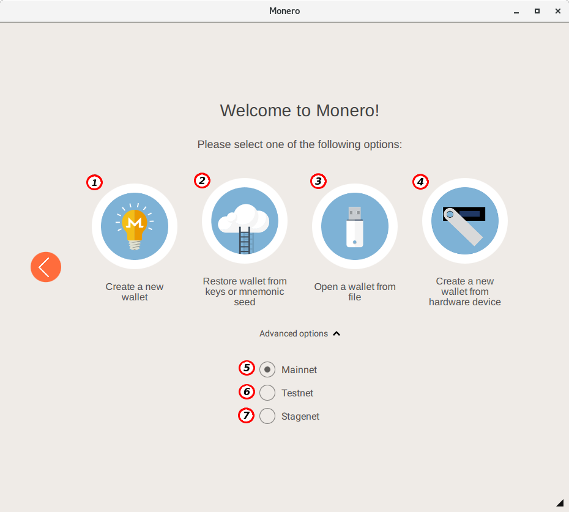
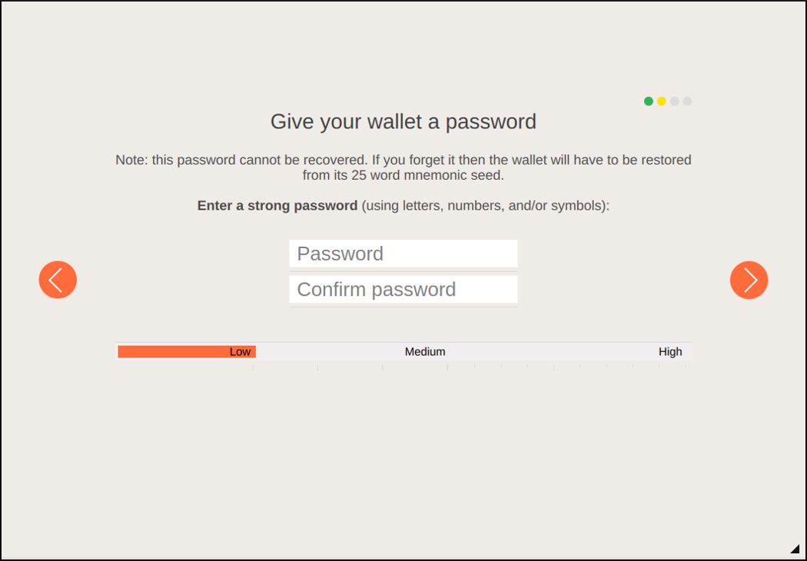
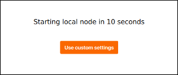
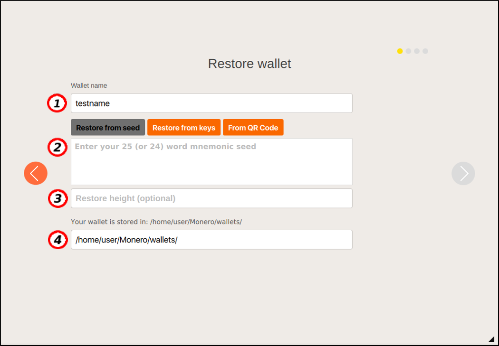
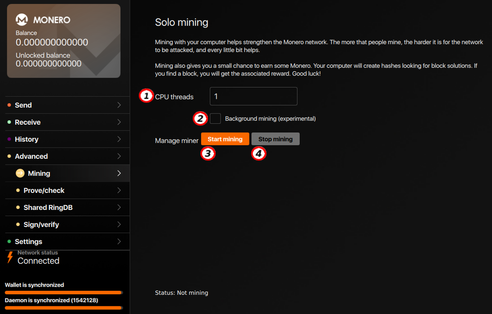
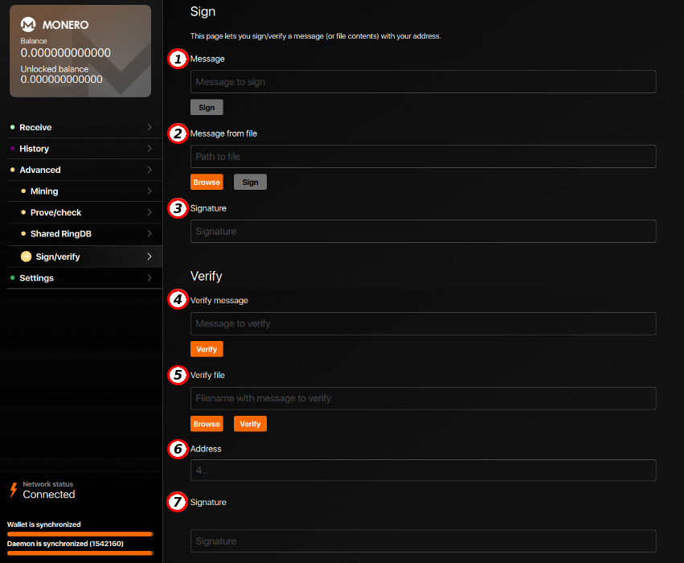
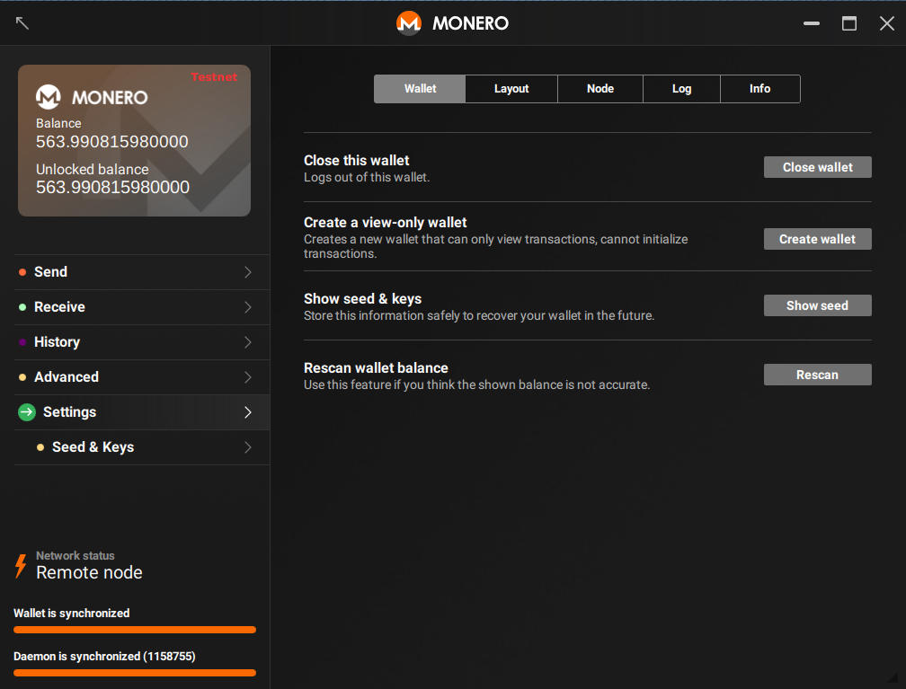

-   [Prefazione](#prefazione)
    -   [Traduzioni](#traduzioni)
    -   [Preparazione Windows](#preparazione-windows)
    -   [Scorciatoie](#scorciatoie)
-   [Scegli una lingua](#scegli-una-lingua)
-   [Creare un portafoglio](#creare-un-portafoglio)
    -   [Crea nuovo portafoglio](#crea-nuovo-portafoglio)
        -   [Aggiungi una password](#aggiungi-una-password)
        -   [Impostazioni del Daemon](#impostazioni-del-daemon)
        -   [Avvia un nodo locale](#avvia-un-nodo-locale)
    -   [Ripristina portafoglio da chiave o seed
        mnemonico](#ripristina-portafoglio-da-chiave-o-seed-mnemonico)
        -   [Ripristino da seed](#ripristino-da-seed)
        -   [Ripristino dalle chiavi](#ripristino-dalle-chiavi)
    -   [Aprire un portafoglio da file](#aprire-un-portafoglio-da-file)
    -   [Creare un nuovo portafoglio
        dall'hardware](#creare-un-nuovo-portafoglio-dallhardware)
        -   [Creare il portafoglio the
            wallet](#creare-il-portafoglio-the-wallet)
-   [Inviare Monero](#inviare-monero)
    -   [Rubrica](#rubrica)
-   [Ricevere Monero](#ricevere-monero)
-   [Funzioni avanzate](#funzioni-avanzate)
    -   [Solo mining](#solo-mining)
    -   [Prova - Controlla](#prova---controlla)
        -   [Prova una Transazione](#prova-una-transazione)
        -   [Controlla una Transazione](#controlla-una-transazione)
    -   [Database degli anelli (RingDB)
        condiviso](#database-degli-anelli-ringdb-condiviso)
    -   [Firma - verifica](#firma---verifica)
        -   [Firma](#firma)
        -   [Verifica](#verifica)
-   [Impostazioni](#impostazioni)
    -   [Portafoglio](#portafoglio)
    -   [Nodo Locale](#nodo-locale)
    -   [Nodo Remoto](#nodo-remoto)
    -   [Log](#log)
    -   [Informazioni](#informazioni)
    -   [Seed e chiavi](#seed-e-chiavi)
-   [Verifica dei file binari](#verifica-dei-file-binari)
-   [Nodi remoti](#nodi-remoti)
    -   [Nodi di bootstrap](#nodi-di-bootstrap)
-   [Problemi comuni e soluzioni
    (in inglese)](#problemi-comuni-e-soluzioni-in-inglese)

Prefazione
==========

Questa guida è open source e manutenuta da ErCiccione, membro della
Comunità Monero. Se hai suggerimenti o vuoi contribuire allo sviluppo di
questa guida, puoi aprire una pull request o Issue sul repositorio
GitHub dove viene sviluppato questo documento:
[github.com/monero-ecosystem/monero-GUI-guide](https://github.com/monero-ecosystem/monero-GUI-guide).
 

Per la versione online di questa guida (in inglese), clicca
[qui](https://github.com/monero-ecosystem/monero-GUI-guide/blob/master/monero-GUI-guide.md)

Traduzioni
----------

Questo documento sarà localizzato in numerose lingue. Puoi trovare tutte
le traduzioni disponibili nella [sezione dedicata su
GitHub](https://github.com/monero-ecosystem/monero-GUI-guide/tree/master/translations).

Preparazione Windows
--------------------

Se usi Windows:

-   Assicurati che il tuo antivirus non blocchi il programma.
-   La prima volta che apri il portafoglio devi concedergli il permesso
    di connettersi alla rete mediante un pop-up. Seleziona la casella
    appropriata e clicca `Consenti Accesso`.

Scorciatoie
-----------

Sono disponibili alcune scorciatoie per semplificare l'esperienza utente
con la GUI:  

**Su tutti i sistemi operativi:** Premi `Ctrl` per vedere la scorciatoia
di ogni pagina. Premi `Ctrl+"scorciatoia"` per andare su quella pagina.\
 

**Su Linux/Windows:**\
`ctrl + tab` -&gt; vai alla pagina successiva `ctrl + shift + tab` -&gt;
vai alla pagina precedente  

**Su macOS:**\
`cmd + tab` -&gt; vai alla pagina successiva `cmd + shift + tab` -&gt;
vai alla pagina precedente

Scegli una lingua
=================

Estrai il file e clicca su `monero-wallet-gui`. Vedrai una lista di
lingue disponibili, clicca su quella che preferisci e vai al passo
successivo.

Creare un portafoglio
=====================

Su questa pagina puoi scegliere fra tre metodi di accesso al portafoglio
e due opzioni per connetterti alla rete:

1.  **Crea nuovo portafoglio:** Inizia la procedura di creazione di un
    nuovo portafoglio. Scegli questa opzione se è la prima volta che
    usi Monero.
2.  **Ripristina portafoglio da chiave o seed mnemonico:** Clicca qui se
    vuoi recuperare un portafoglio pre-esistente usando il seed
    mnemonico o la chiave.
3.  **Apri un portafoglio da file:** Scegli questa opzione per
    selezionare un portafoglio pre-esistente dai tuoi file con
    estensione `.keys`.
4.  **Crea un nuovo portafoglio da un dispositivo hardware:** Crea un
    nuovo portafoglio da un dispositivo hardware (ad esempio Ledger)
5.  **Mainnet:** *Opzioni avanzate:* Usa la rete Monero principale
6.  **Testnet:** *Opzioni avanzate:* Seleziona questa casella se vuoi
    usare una rete di sviluppo invece della rete principale. La Testnet
    ha lo scopo di consentire agli sviluppatori di effettuare dei test
    su nuove funzionalità che non sono disponibili sulla Mainnet o
    sulla Stagenet.
7.  **Stagenet:** *Opzioni avanzate:* Seleziona questa casella se vuoi
    usare una rete di prova invece della rete principale. La Stagenet
    riproduce le stesse funzionalità della Mainnet ed ha lo scopo di
    consentire agli utenti finali di provare Monero senza correre il
    rischio di perdere i propri fondi.

Crea nuovo portafoglio
----------------------

Qui puoi creare un nuovo portafoglio:

1.  **Nome del portafoglio:** Dai un nome al tuo portafoglio (in questo
    esempio il nome usato è `testname`).
2.  **Seed mnemonico: Prendi nota del tuo [seed
    mnemonico](https://getmonero.org/it/resources/moneropedia/mnemonicseed.html)
    e tienilo al sicuro. Il tuo seed è la chiave principale del tuo
    portafoglio, puoi usarlo per recuperare i tuoi fondi.**
3.  **Posizione del portafoglio:** Seleziona la cartella di destinazione
    del portafoglio.

### Aggiungi una password

Aggiungi una password complessa per proteggere il tuo portafoglio. Se
perdi la tua password, solamente il tuo seed mnemonico può recuperare il
tuo portafoglio.

### Impostazioni del Daemon

Qui puoi scegliere se avviare un nodo locale o utilizzare un nodo
remoto:

1.  **Avvia nodo in background:** Seleziona questa casella per avviare
    un nodo locale ed iniziare la sincronizzazione della blockchain.
2.  **Posizione blockchain (opzionale):** Per salvare la blockchain in
    un'altra posizione rispetto a quella di default, inserisci la
    posizione desiderata.
3.  **Nodo di bootstrap:** Per usare un nodo di bootstrap inserisci
    l'host e la porta. Un nodo di bootstrap ti consente di usare il
    portafoglio mentre stai scaricando la blockchain connettendosi ad un
    nodo remoto. Per una lista di nodi remoti disponibili ed
    informazioni su di essi, dai uno sguardo alla sezione [Nodi
    remoti](#8-about-remote-nodes) in questa guida.
4.  **Connettiti ad un nodo remoto:** Seleziona questa casella se vuoi
    usare solo un nodo remoto senza scaricare la blockchain. Avrai
    bisogno di inserire l'host e la porta del nodo remoto dopo aver
    selezionato la casella.

### Avvia un nodo locale

Alla fine del setup sarai riportato/a al menu delle impostazioni, ma
prima vedrai una finestra come questa:

Se vuoi creare un portafoglio normale utilizzando il tuo nodo locale
personale, non avrai bisogno di fare nulla, lascia che il conto alla
rovescia termini e poi attendi fino a quando il tuo nodo sarà totalmente
sincronizzato.\
Se necessiti di alcune impostazioni speciali, ad esempio preparare un
portafoglio solo-visualizzazione o aggiungere manualmente la blockchain,
vai alla [sezione 3](#3-settings)

Ripristina portafoglio da chiave o seed mnemonico
-------------------------------------------------

### Ripristino da seed

Il ripristino dal tuo seed mnemonico è il metodo più veloce per
recuperare il tuo portafoglio. Dovrai inserire le seguenti informazioni:

1.  **Nome del portafoglio:** Dai un nome al tuo portafoglio (in questo
    esempio viene usato `testname`).
2.  **Seed mnemonico:** Incolla il tuo seed composto da 25 (o 24)
    parole.
3.  **Altezza di ripristino (opzionale):** Se conosci l'altezza di
    blocco alla quale il tuo portafoglio è stato creato, puoi
    specificarla qui in modo tale che il portafoglio non debba
    scansionare l'intera blockchain alla ricerca dei tuoi fondi. Per
    esempio, se la tua prima transazione è stata inclusa nel blocco
    `135000`, puoi inserire un'altezza leggermente più bassa (ad esempio
    `1330000`) ed il portafoglio inizierà la scansione da quel punto,
    risparmiando tempo.
4.  **Posizione del portafoglio:** Seleziona la cartella di destinazione
    del portafoglio.

Una guida dettagliata è disponibile su getmonero.org: ['Come
ripristinare il tuo
account'](https://getmonero.org/it/resources/user-guides/restore_account.html)

### Ripristino dalle chiavi

Il ripristino dalle chiavi è abbastanza semplice e può essere
estremamente utile, specialmente se stai trasferendo il tuo portafoglio
da un servizio online come MyMonero. Dovrai inserire le seguenti
informazioni:

1.  **Nome del portafoglio:** Dai un nome al tuo portafoglio (in questo
    esempio viene usato `testname`).
2.  **Indirizzo portafoglio:** L'indirizzo del portafoglio che
    stai ripristinando.
3.  **Chiave di visualizzazione:** La tua chiave privata di
    visualizzazione (necessaria per controllare i tuoi fondi).
4.  **Chiave di spesa:** La tua chiave privata di spesa (necessaria per
    spendere i tuoi fondi).
5.  **Altezza di ripristino (opzionale):** Se conosci l'altezza di
    blocco alla quale il tuo portafoglio è stato creato, puoi
    specificarla qui in modo tale che il portafoglio non debba
    scansionare l'intera blockchain alla ricerca dei tuoi fondi. Per
    esempio, se la tua prima transazione è stata inclusa nel blocco
    `135000`, puoi inserire un'altezza leggermente più bassa (ad esempio
    `1330000`) ed il portafoglio inizierà la scansione da quel punto,
    risparmiando tempo.
6.  **Posizione del portafoglio:** Seleziona la cartella di destinazione
    del portafoglio.

Quando è tutto pronto, fai click sulla freccia a destra e poi sul
pulsante `USA MONERO`.\
Una guida dettagliata è disponibile su getmonero.org: ['Ripristinare il
portafoglio dalle
chiavi'](https://getmonero.org/it/resources/user-guides/restore_from_keys.html)

Aprire un portafoglio da file
-----------------------------

Dopo aver fatto click su questa opzione, si aprirà una finestra. Naviga
fino al tuo file con estensione `.keys`, selezionalo e clicca sulla
freccia a destra.

Creare un nuovo portafoglio dall'hardware
-----------------------------------------

### Creare il portafoglio the wallet

1.  **Nome del portafoglio:** Dai un nome al tuo portafoglio (in questo
    esempio viene usato `ledger-test`).
2.  **Altezza di ripristino (opzionale):** Se conosci l'altezza di
    blocco alla quale il tuo portafoglio è stato creato, puoi
    specificarla qui in modo tale che il portafoglio non debba
    scansionare l'intera blockchain alla ricerca dei tuoi fondi. Per
    esempio, se la tua prima transazione è stata inclusa nel blocco
    `135000`, puoi inserire un'altezza leggermente più bassa (ad esempio
    `1330000`) ed il portafoglio inizierà la scansione da quel punto,
    risparmiando tempo.
3.  **Lookahead sottoindirizzo (opzionale):** Genera in anticipo un
    numero di account ognuno con un numero di sottoindirizzi.
4.  **Nome del dispositivo:** Seleziona il portafoglio hardware che vuoi
    usare (al momento è disponibile solo 'Ledger')
5.  **Posizione del portafoglio:** Seleziona la cartella di destinazione
    del portafoglio.  

Tutti i passi successivi sono gli stessi spiegati da
[2.1.1](#211-add-a-password) a [2.1.3](#213-run-a-full-node)  

Guida passo-passo per generare un portafoglio Ledger con la GUI Monero
per tutti i sistemi operativi (StackExchange): [Come posso generare un
portafoglio Ledger Monero con la GUI (monero-wallet-gui)? (in
inglese)](https://monero.stackexchange.com/questions/9901/how-do-i-generate-a-ledger-monero-wallet-with-the-gui-monero-wallet-gui)

Inviare Monero
==============

La scheda `Invia` fornisce strumenti per creare transazioni in uscita.

1.  **Ammontare:** Indica quanti Moneroj vuoi inviare.
2.  **Priorità transazione:** Questo è il livello di priorità che la tua
    transazione riceverà nel pool di transazioni in attesa di
    essere confermate. Più paghi, più sarà alta la priorità della
    transazione per l'inclusione in un blocco. *Al momento attuale, una
    transazione con priorità di default o lenta, con buona probabilità,
    viene inclusa nel prossimo blocco.*
3.  **Indirizzo:** In questo campo viene inserito l'indirizzo Monero
    di destinazione. La migliore pratica consiste nel copiare ed
    incollare l'indirizzo per evitare errori. Assicurati che l'indirizzo
    copiato-incollato sia corretto.
4.  **ID Pagamento (opzionale):** L'ID Pagamento è un identificatore
    allegato alla transazione che si sta per iniziare. Spesso quando la
    transazione ha come destinatario un exchange, essi ti comunicano un
    ID Pagamento che devi includere nella transazione. In questo modo
    l'exchange può sapere quale delle transazioni in ingresso è la tua.
    *Nel caso in cui dimenticassi di inserire l'ID Pagamento nella
    transazione, hai comunque la possibilità di recuperare i tuoi fondi
    contattando il destinatario cui hai invato i Moneroj.*
5.  **Descrizione (opzionale):** Questa costituisce la tua
    memoria storica. Puoi aggiungere informazioni riguardanti la tua
    transazione che potrebbero servirti in futuro.
6.  **Sweep dei non mixabili:** Questa opzione ti dà la possiblità di
    liberarti degli output nel tuo portafoglio che hanno strani
    ammontare come `0.000006839355`. Questi output sono inamovibili a
    meno di combinarli con altri output. *La maggior parte degli utenti
    non avrà mai bisogno di ricorrere a questa funzione.*\
7.  **Firma file tx:** Questo pulsante ti consente di firmare un file di
    transazione creato su un portafoglio di tipo sola-visualizzazione.
8.  **Esporta immagini chiave:** Questa opzione ti permette di esportare
    le immagini delle chiavi. Sono necessarie per vedere il bilancio di
    un portafoglio solo-visualizzazione.

Rubrica
-------

La scheda `Rubrica` ti consente di salvare indirizzi con i quali fai
transazioni. È un luogo conveniente dal quale copiare gli indirizzi
quando si crea una transazione.

Ricevere Monero
===============

La scheda `Ricevi` fornisce strumenti per generare sottoindirizzi,
effettuare richieste di pagamento e monitorare transazioni in ingresso.

1.  **Indirizzi:** Questa è una lista del tuo indirizzo primario e
    dei sottoindirizzi.
2.  **Crea un nuovo indirizzo:** Questo pulsante ti consente di creare
    nuovi sottoindirizzi. Ne puoi creare quanti ne vuoi. *Ulteriori
    informazioni sui [sottoindirizzi
    (in inglese)](https://monero.stackexchange.com/questions/3673/what-is-a-sub-address).*
3.  **Opzioni avanzate:** Facendo click qui verrai indirizzato/a alla
    sezione avanzata.
4.  **Ammontare:** Serve a creare la richiesta di pagamento, inserisci
    qui la quantità di Moneroj che vuoi ricevere.
5.  **Tracciamento:** Se metti la spunta su questa casella, vedrai una
    lista di transazioni in ingresso.
6.  **Codice QR:** Questo è un codice QR che contiente il tuo indirizzo
    selezionato, e in maniera opzionale l'ammontare. Esso può essere
    usato per comunicare agli altri il tuo indirizzo Monero scansionando
    il codice.

Funzioni avanzate
=================

Solo mining
-----------

 La scheda `Mining` fornisce un miner
CPU, attivabile con un click, incorporato nella GUI.

1.  **Threads CPU:** Numero di thread CPU da usare per il mining.
2.  **Minare in background:** Seleziona questa casella per abilitare il
    mining in background. La funzione è sperimentale. Questo ti consente
    di utilizzare il tuo computer normalmente mentre effettui mining.
3.  **Avvia mining:** Avvia il miner.
4.  **Arresta mining:** Ferma il miner.

Prova - Controlla
-----------------

La scheda `Prova/controlla` fornisce strumenti per provare un pagamento
o validare una prova di pagamento. Questo è necessario con Monero poiché
questi dettagli non sono disponibili sulla blockchain.

### Prova una Transazione

Questa funzione genera una prova di avvenuto pagamento ad un certo
indirizzo. Dovrai inserire le seguenti informazioni:

1.  **ID Transazione:** Questo è l'ID del pagamento per il quale stai
    creando una prova. Puoi trovare i dettagli della transazione
    selezionando la scheda `Storico` dal menu a sinistra.
2.  **Indirizzo:** Questo è l'indirizzo al quale stai dando la prova di
    avvenuto pagamento.
3.  **Messaggio (opzionale):** Questo è un messaggio opzionale che sarà
    firmato con i dettagli della transazione. Se scegli di includere un
    messaggio, anche l'altra parte dovrà includere esattamente lo stesso
    messaggio al fine di verificare la tua prova.
4.  **Genera:** Fai click qui una volta inseriti tutti i dettagli per
    generare la tua prova.  

Una guida dettagliata è disponibile su getmonero.org ['Come provare un
pagamento'](https://getmonero.org/it/resources/user-guides/prove-payment.html)

### Controlla una Transazione

Questa funzione prova l'avvenuto pagamento. Dovrai inserire le seguenti
informazioni:

5.  **ID Transazione:** Questo è l'ID del pagamento che vuoi verificare.
6.  **Indirizzo:** Questo è l'indirizzo di ricezione del pagamento che
    vuoi verificare.
7.  **Messaggio (opzionale):** Questo è il messaggio opzionale che
    potrebbe essere stato incluso all'interno della prova.
8.  **Firma:** Questa è la firma generata per provare il pagamento.
9.  **Controlla:** Fai click qui una volta inseriti tutti i dettagli per
    controllare la validità della prova di avvenuto pagamento.

Database degli anelli (RingDB) condiviso
----------------------------------------

Questo è un strumento avanzato che può essere usato per migliorare la
privacy delle firme ad anello. Gli output usati nelle firme ad anello
possono essere adattati per mitigare perdite di privacy quando viene
usato un fork che riusa le chiavi o per evitare output che certamente
non possono essere spesi in questa transazione.

1.  **Nome del file di blackball:** Questo strumento applicherà la
    blackball ad output noti per essere stati spesi. Dopo aver eseguito
    monero-blockchain-blackball, importa il file risultante per evitare
    di usare questi output come esche nella costruzione delle firme
    ad anello. Questo file è salvato di default nella
    cartella .shared-ringdb.
2.  **Applica blackball ad output:** Questa azione applicherà o
    rimuovera la blackball ad un singolo output scelto. Gli output
    vengono rappresentati con stringhe da 64 caratteri. L'output
    inserito in questo campo non sarà usato come esca nella firma ad
    anello costruita. Gli output rimossi dalla blackball potrebbero (ma
    non necessariamente) essere usati come esche.
3.  **Input immagine della chiave:** Inserisci l'immagine della chiave
    usata nel fork che riusa le chiavi.
4.  **Ottieni anello:** Premi il pulsante `Ottieni anello` per ottenere
    i membri dell'anello per l'immagine della chiave del punto 3.
5.  **Imposta anello:** Premo il pulsante `Imposta anello` per impostare
    i membri dell'anello di una transazione. Copia i membri dell'anello
    dal punto 4. per selezionare quelli dell'immagine della chiave, o
    impostali manualmente.
6.  **Intenzione di spendere:** Seleziona questa opzione se sei certo
    che spenderai Moneroj in un fork che riusa le chiavi. Questa scelta
    forzerà in modo aggressivo l'algoritmo di scelta degli input per
    darti la massima negabilità plausibile.
7.  **Possibilità di spendere:** Seleziona questa opzione se potresti
    spendere Moneroj in un fork che riusa le chiavi. Questa scelta
    modificherà l'algoritmo di scelta degli input. Deseleziona questa
    opzione solo se sei certo che non utilizzerai un fork che riusa
    le chiavi.
8.  **Relativo:** Se selezionato, gli offset sono codificati
    relativamente ai precedenti, al contrario di quelli codificati in
    modo assoluto (le transazioni usano offset relativi)
9.  **Altezza di segregazione:** L'altezza di blocco alla quale il fork
    che riusa le chiavi si separa.

Firma - verifica
----------------

La scheda `Firma/verifica` fornisce strumenti per firmare un messaggio o
un file con la tua chiave privata o verificare l'autenticità di un
messaggio o file firmato.

### Firma

1.  **Messaggio:** In questo campo puoi inserire un messaggio
    da firmare.
2.  **Messaggio da file:** In questo campo puoi indicare un file
    da firmare. Fai click su `Esplora` per navigare il filesystem.
3.  **Firma:** In questo campo apparirà la tua firm univoca una volta
    premuto il pulsante `Firma`. Questa è legata alla tua chiave privata
    e al messaggio o file inserito. Essa verrà utilizzata come prova
    insieme al messaggio o al file che è stato firmato.

### Verifica

4.  **Verifica messaggio:** In questo campo inserirai il messaggio che è
    stato firmato
5.  **Verifica file:** In questo campo inserirai il percorso del file
    che è stato firmato. Fai click su `Esplora` per navigare
    il filesystem.
6.  **Indirizzo:** In questo campo inserirai l'indirizzo pubblico Monero
    del firmatario.
7.  **Firma:** In questo campo inserirai la firma che stai verificando.
    Una volta che tutte le informazioni richieste saranno inserite fai
    click sul pulsante `Verifica`. Un messaggio popup ti informerà se la
    firma è valida.

Impostazioni
============

La scheda `Impostazioni` fornisce strumenti per personalizzare le
opzioni di configurazione.

### Portafoglio

### Nodo Locale

1.  **Avvia/Ferma Nodo Locale:** In base al suo stato corrente, avvia o
    ferma il nodo.
2.  **Posizione Blockchain:** Inserimento manuale di un percorso non di
    default per la blockchain.
3.  **Flag per il Daemon:** Quando si usa un nodo locale, in questo
    campo possono essere inserite opzioni aggiuntive a linea di comando.
4.  **Indirizzo di Bootstrap:** Inserisci l'hostname o l'indirizzo IP
    del nodo remoto di bootstrap. Vedi la sezione [8.1 nodi di
    Bootstrap](#8.1-bootstrap-nodes) per una veloce spiegazione su cosa
    è un nodo di Bootstrap.
5.  **Porta di Bootstrap:** Inserisci la porta del nodo remoto
    di bootstrap.

### Nodo Remoto

Usa un nodo remoto, non scarica la blockchain in locale. Dai uno sguardo
alla [sezione 'Nodi Remoti'](#8-about-remote-nodes) di questa guida.

1.  **Indirizzo:** Inserisci l'hostname o l'indirizzo IP del
    nodo remoto.
2.  **Porta:** Inserisci la porta del nodo remoto.
3.  **Nome utente Daemon:** Inserisci un nome utente nel caso in cui sia
    richiesta l'autenticazione al nodo remoto.
4.  **Password Daemon:** Inserisci una password nel caso in cui sia
    richiesta l'autenticazione al nodo remoto.

### Log

1.  **Livello log:** Cambia la verbosità dei log di debug.
2.  **Categorie log:** Aggiunge specifiche categorie ai log di debug.
3.  **Log Daemon:** Output del log in tempo reale.
4.  **Linea di comando:** Interagisce col daemon.

### Informazioni

1.  **Versione GUI:** Versione del portafoglio GUI installato.
2.  **Versione Monero Incorporata:** Versione del daemon incorporato
    in uso.
3.  **Persorso portafoglio:** Percorso del computer in cui si trova
    il portafoglio.
4.  **Altezza creazione portafoglio:** Cambia l'altezza di blocco da cui
    inizierà la scansione del portafoglio.
5.  **Percorso log portafoglio:** Percorso in cui verranno salvati i log
    del portafoglio.
6.  **Copia negli appunti:** Copia negli appunti tutte
    queste informazioni.

Seed e chiavi
-------------

La scheda `Chiavi & Seed` visualizza il seed mnemonico del tuo
portafoglio nonché la chiave privata di visualizzazione, la chiave
pubblica di visualizzazione, la chiave privata di spesa e la chiave
pubblica di spesa.

1.  **Seed mnemonico: NON condividere con nessuno il tuo seed mnemonico.
    Conservane una copia in un luogo sicuro.** Il seed mnemonico è una
    frase di 25 parole che contiene tutte le informazioni necessarie per
    controllare e spendere i fondi. *Ulteriori informazioni sui [seed
    mnemonici](https://getmonero.org/it/resources/moneropedia/mnemonicseed.html).*
2.  **Chiave segreta (privata) di visualizzazione:** Le chiavi
    segrete (private) di visualizzazione consentono al possessore di
    visualizzare le transazioni in ingresso ai tuoi portafogli, ma non
    quelle in uscita. Spesso può risultare utile comunicare le tue
    chiavi segrete di visualizzazione ad una terza parte per finalità
    di controllo.
3.  **Chiave pubblica di visualizzazione:** La chiave pubblica di
    visualizzazione viene usata per la creazione
    dell'indirizzo nascosto. *Ulteriori informazioni sulle [chiavi di
    visualizzazione](https://getmonero.org/it/resources/moneropedia/viewkey.html).*
4.  **Chiave segreta (privata) di spesa: NON condividere con nessuno la
    tua chiave segreta di spesa. La chiave segreta di spesa viene
    utilizzata per firmare le transazioni e dovrebbe essere trattata con
    la stessa sicurezza con la quale viene trattato il tuo
    seed mnemonico.**
5.  **Chiave pubblica di spesa:** La chiave pubblica di spesa viene
    usata dalla rete per verificare la firma dell'immagine della chiave
    da te generata quando effettui una transazione. Questo controllo
    serve a prevenire il double-spending dal momento che la rete fa
    rispettare la regola per cui un'immagine della chiave può essere
    spesa solamente una volta. *Ulteriori informazioni sulle [chiavi di
    spesa](https://getmonero.org/it/resources/moneropedia/spendkey.html).*
6.  **Esporta portafoglio spendibile: NON condividere con nessuno il
    codice QR del tuo portafoglio spendibile. Questo codice può essere
    usato come un seed mnemonico per ripristinare il tuo portafoglio**.
    Questa funzione crea un codice QR che contiene tutte le chiavi del
    tuo portafoglio.
7.  **Esporta portafoglio solo-visualizzazione:** Questa funzione crea
    un codice QR che contiene solo le chiavi per visualizzare le
    transazioni che questo portafoglio invia o riceve, ma non contiene
    le chiavi che consentono di effettuare transazioni.

Verifica dei file binari
========================

Verifica che i file che hai scaricato siano quelli originali. Puoi usare
[questa guida
passo-passo](https://getmonero.org/it/resources/user-guides/verification-windows-beginner.html)
con figure annesse (facile, per utenti Windows).

Nodi remoti
===========

I nodi remoti possono essere molto utili se non sei in grado o non vuoi
scaricare l'intera blockchain, ma considera che nodi remoti
malintenzionati potrebbero compromettere il livello di privacy della tua
transazione, tracciando il tuo indirizzo IP o, in casi estremi,
rivelando l'ammontare della transazione. Detto questo, una lista di nodi
remoti è disponibile su [moneroworld.com](https://moneroworld.com).
Tieni presente che ognuno è in grado di aggiungere un nodo a quella
lista, pertanto non dovresti considerare questi nodi come fidati o
sicuri; per la migliore privacy, è bene ricorrere al tuo nodo locale.

Nodi di bootstrap
-----------------

Un nodo di bootstrap è un nodo remoto che può essere usato mentre si sta
sincronizzando la blockchain. È differente da un nodo remoto semplice
perché l'utilizzo di quest'ultimo non sincronizza la blockchain in
locale. Se viene usato un nodo di bootstrap, a questo subentrerà il nodo
locale non appena la blockchain sarà completamente sincronizzata,
indipendentemente dal fatto che l'utente abbia inserito il nodo remoto o
che il nodo remoto sia specificato di default. Ulteriori informazioni su
https://getmonero.org/it/resources/moneropedia/bootstrap-node.html

Problemi comuni e soluzioni (in inglese)
========================================

-   **[Mi manca (non vedo) una transazione nella GUI
    (saldo zero)](https://monero.stackexchange.com/questions/6640/i-am-missing-not-seeing-a-transaction-to-in-the-gui-zero-balance)**
-   **[Sto usando la GUI e il mio daemon non parte
    più](https://monero.stackexchange.com/questions/6825/i-am-using-the-gui-and-my-daemon-doesnt-start-anymore)**
-   **[Transazione ferma in stato "IN ATTESA" nella
    GUI](https://monero.stackexchange.com/questions/6649/transaction-stuck-as-pending-in-the-gui)**
-   **[La mia GUI sembra abbia un bug / si congela tutto il
    tempo](https://monero.stackexchange.com/questions/6651/my-gui-feels-buggy-freezes-all-the-time)**
-   **[Il mio nome contiene un carattere speciale (non-ASCII) (ad
    esempio é, ø, â, Ö) e non posso creare un portafoglio con la
    GUI](https://monero.stackexchange.com/questions/6823/my-name-contains-a-special-non-ascii-character-e-g-%c3%a9-%c3%b8-%c3%a2-%c3%96-and-i-cant-c)**
-   **[La GUI usa tutta la mia banda e non posso più navigare su
    internet o utilizzare un'altra applicazione che richiede la
    connessione ad
    internet](https://monero.stackexchange.com/questions/6653/the-gui-uses-all-my-bandwidth-and-i-cant-browse-anymore-or-use-another-applicat)**
-   **[Come posso spostare la blockchain (data.mdb) in un'altra
    directory durante (o dopo) la sincronizzazione iniziale senza
    perdere i
    progressi?](https://monero.stackexchange.com/questions/7225/how-do-i-move-the-blockchain-data-mdb-to-a-different-directory-during-or-afte)**
-   **[Come posso cambiare la lingua del seed mnemonico da 25 parole
    nella GUI o nella
    CLI?](https://monero.stackexchange.com/questions/7373/how-do-i-change-the-language-of-the-25-word-mnemonic-seed-in-the-gui/)**
-   **[La mia blockchain si è bloccata, come la
    sblocco?](https://monero.stackexchange.com/questions/4462/my-blockchain-is-stuck-how-do-i-unstuck-it)**
-   **[Sto usando un nodo remoto, ma la GUI ancora sincronizza la
    blockchain?](https://monero.stackexchange.com/questions/6324/using-remote-node-still-syncs-blockchain)**
-   **Uso un monitor ad alta risoluzione e la GUI sembra estremamente
    piccola** Questo problema sarà presto risolto, ma per Windows c'è
    una soluzione temporanea: fai click con il destro su
    monero-wallet-gui.exe, seleziona proprietà --&gt; compatibilità.
    Troverai un'opzione 'DPI alto', cambia il suo valore da
    "Applicazione" a "Sistema" o viceversa.

